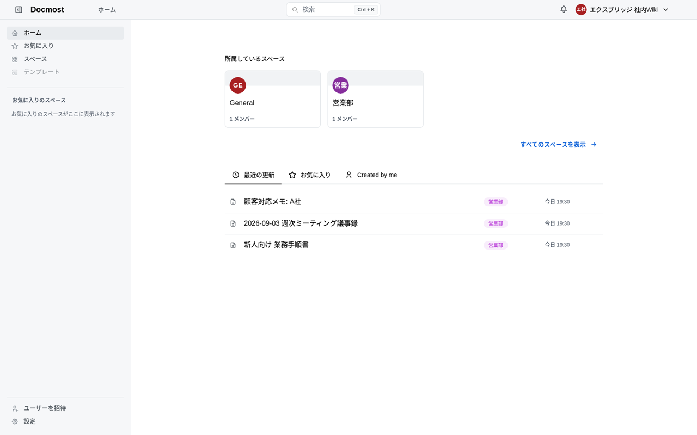
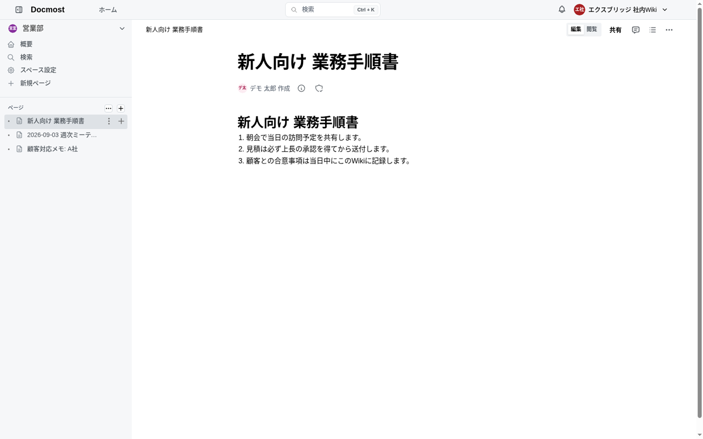
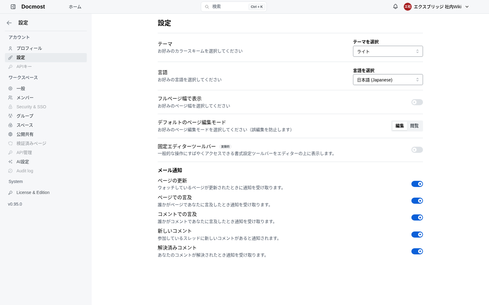

社内の手順書・議事録・顧客メモを Notion や Confluence に置いている会社は多いと思います。「人数課金が積み上がる」「社外のクラウドに社内文書を置きたくない」という声に対して、**自社サーバーで動く社内Wiki OSS「Docmost（ドックモスト）」**を実際に立てて、日本語で使えるところまで確かめました。

結論を先に書きます。

- **docker一式で数分**で動きます（本体＋PostgreSQL＋Redis の3コンテナ。当社環境では起動から画面表示まで6秒）
- **日本語UIは翻訳率100%（1,339／1,339キー）**。設定で日本語を選ぶだけで、画面はほぼ完全に日本語です
- ただし **日本語の全文検索には穴があります**。「見積」「A社」は当たるのに「議事録」「契約更新」が0件——複合語の切り方が原因で、運用で回避できます（後述）
- 無料の Community 版で、リアルタイム共同編集・スペース・全文検索・Markdown入出力まで使えます。SSO・細かい権限・Confluence直接インポートは有料版です

数字はすべて 2026年9月3日に v0.95.0（最新）で実測したものです。

## Docmostとは

[Docmost](https://github.com/docmost/docmost) は TypeScript 製のオープンソース Wiki・ドキュメント共有ツールです（AGPL-3.0・GitHubスター約21,500）。Notion や Confluence の「ページを階層で整理し、複数人で同時に編集する」使い勝手を、自社サーバーで再現することを狙っています。

- **リアルタイム共同編集**：同じページを複数人が同時に編集でき、カーソルが見えます
- **スペース**：部署やプロジェクト単位の「本棚」。スペースごとにメンバーと権限を持ちます
- **ページの階層**：スペースの中でページを入れ子にし、左のツリーで辿ります
- **図**：Draw.io、Excalidraw、Mermaid をページ内に描けます
- **コメント・メンション・通知**：ページやコメントで @メンションすると通知が飛びます（メール通知も設定可）
- **全文検索**、**公開共有**（社外にページを公開URLで見せる）、**Markdown／HTML の入出力**
- 認証はメール＋パスワードが標準。Google 等の SSO は有料版

無料版（Community Edition）と有料版（Business／Enterprise）の境界は、公式の料金ページの説明どおりです。Community に含まれるのは共同編集・スペース・全文検索、Business で加わるのが **SSO・AI機能・細かい権限・Confluence からの直接インポート・メールサポート**です。リポジトリ内でも `apps/server/src/ee` と `apps/client/src/ee` だけが別ライセンスで、それ以外は AGPL です。

## 数分で立てる（docker・公式構成）

公式リポジトリの `docker-compose.yml` をそのまま使い、公開URLと秘密鍵だけ変えます。

```yaml
services:
  docmost:
    image: docmost/docmost:latest
    depends_on: [db, redis]
    environment:
      APP_URL: "https://wiki.example.co.jp"      # 社員がアクセスするURL
      APP_SECRET: "openssl rand -hex 32 の出力"   # 必ず変える
      DATABASE_URL: "postgresql://docmost:STRONG_DB_PASSWORD@db:5432/docmost"
      REDIS_URL: "redis://redis:6379"
    ports: ["3000:3000"]
    volumes: [docmost:/app/data/storage]
    restart: unless-stopped
  db:
    image: postgres:18
    environment: { POSTGRES_DB: docmost, POSTGRES_USER: docmost, POSTGRES_PASSWORD: STRONG_DB_PASSWORD }
    volumes: [db_data:/var/lib/postgresql]
    restart: unless-stopped
  redis:
    image: redis:8
    command: ["redis-server", "--appendonly", "yes", "--maxmemory-policy", "noeviction"]
    volumes: [redis_data:/data]
    restart: unless-stopped
volumes: { docmost: {}, db_data: {}, redis_data: {} }
```

`docker compose up -d` の後、最初にブラウザで開くと**ワークスペース名と管理者アカウントを作る画面**が出ます。ここで作ったのが最初の管理者です。以降のメンバーは「ユーザーを招待」から追加します（招待メールを飛ばすには SMTP の設定が要ります。`MAIL_DRIVER=smtp` と `SMTP_HOST` 以下の環境変数で指定します）。

添付ファイルは既定でコンテナ内のボリューム `docmost` に入ります。容量が増えるなら `STORAGE_DRIVER=s3` で S3 互換ストレージ（MinIO 等）に逃がせます。

## 日本語で使う

右上のワークスペース名 → 設定 → アカウントの「設定」→ 言語で **日本語 (Japanese)** を選びます。言語はユーザーごとの設定です。



デモとして「営業部」スペースに、新人向け手順書・週次議事録・顧客メモの3ページを入れました。ページは Markdown で作れます（後述のインポートで一括投入も可）。



設定画面も日本語です。左メニューでグレーになっている「Security & SSO」「Audit log」「API管理」が有料版の機能で、ここだけ英語のまま残ります。



翻訳ファイルを直接数えると、英語 `en-US/translation.json` の **1,339キーに対して日本語 `ja-JP` も 1,339キー**で、未訳はありませんでした。当社がこれまで見てきた OSS（Krayin は日本語なし、Zammad は23%、Vikunja は91%）と比べても、Docmost の日本語対応は完成度が高いです。

## 実測で見つけた穴：日本語の全文検索

翻訳が100%でも、**検索は別問題**でした。デモの3ページに対して検索した結果がこちらです。

| 検索語 | 結果 | 本文にある語 |
|---|---|---|
| 見積 | 1件ヒット | 「見積は必ず上長の承認を…」 |
| A社 | 2件ヒット | 「顧客対応メモ: A社」「A社の契約更新は…」 |
| 業務手順 | 1件ヒット | 「新人向け 業務手順書」 |
| **議事録** | **0件** | 「週次ミーティング議事録」（タイトルにある） |
| **契約更新** | **0件** | 「A社の契約更新は9/10まで…」 |

「議事録」はページタイトルに含まれているのに当たりません。原因は検索基盤です。Docmost の全文検索は PostgreSQL の機能（tsvector）を使っており、これは**空白や記号で単語を切る**設計です。日本語は空白で区切らないので、「週次ミーティング議事録」はひとかたまりの語として索引され、「議事録」という部分では一致しません。「見積」が当たったのは「見積は」の「は」の前で、「A社」は「A社の」の助詞の前で、たまたま切れ目ができていたからです。

### 運用での回避策（実測で効いたもの）

1. **タイトルは検索されたい単位で区切る**：「2026-09-03 週次ミーティング 議事録」のように、語の間に空白を入れる。これだけで「議事録」が当たります
2. **本文の冒頭に「キーワード行」を置く**：ページ先頭に「関連: 議事録 / 営業部 / A社 / 契約更新」のような1行を書く。人にも検索にも効きます
3. **顧客名・案件名は英数字や記号で囲む**：「A社」「【契約更新】」のように、日本語の連続を切る
4. **スペースとページ階層で辿れる設計にする**：検索に頼りきらず、部署スペース → 種別（手順書／議事録／顧客）→ ページ、と左のツリーで到達できる形にしておく

これは Docmost 固有というより、PostgreSQL の全文検索を日本語で使う OSS 全般に共通する話です。将来のバージョンで改善される可能性はありますが、**導入時点では運用で補う**のが現実的です。

## 移行・入出力（無料版でどこまで）

- **ページの書き出し**：Markdown／HTML で1ページずつ。スペース単位なら zip で一括
- **取り込み**：Markdown ファイルのインポートは無料版で使えます（実測で成功）。Notion からは「Markdown & CSV でエクスポート」した zip を解いて取り込む流れ、Confluence からは「HTML でエクスポート」して変換するか、有料版の直接インポートを使います
- つまり **Notion → Docmost は無料版で完結**、Confluence → Docmost は手間か有料版のどちらか、という整理になります

## 会社で使うときの勘所（実測から）

**バックアップは3か所**。PostgreSQL のダンプ（`docker compose exec db pg_dump -U docmost docmost`、デモの3ページで124KB）、添付ファイルのボリューム `docmost`、そして Redis（通知やセッション用なので、失っても致命的ではない）。日次で前の2つを取れば復旧できます。

**スペース＝部署、ページ階層＝種別**。スペースにメンバーと権限が付くので、部署をスペースにするのが自然です。その下に「手順書」「議事録」「顧客」の親ページを作り、その配下に増やしていくと、検索の穴を階層で補えます。

**招待制で運用する**。最初の管理者以外は「ユーザーを招待」で追加します。SMTP を設定しておかないと招待メールが飛ばないので、立てた直後に設定します。

**添付の上限**。既定のアップロード上限は環境変数 `FILE_UPLOAD_SIZE_LIMIT` で変えられます。リバースプロキシ側（nginx の `client_max_body_size`）も合わせて上げます。

**更新**。`docker compose pull && docker compose up -d`。メジャー更新の前に pg_dump を取ってからにします。

## まとめ

- Docmost は Notion／Confluence の「階層＋同時編集」を、自社サーバーで、無料版のまま再現できます。3コンテナで数分です
- 日本語UIは100%で、設定1か所で完全に日本語になります
- ただし日本語の全文検索は複合語を拾えないことがあります。タイトルに空白を入れる・キーワード行を置く・階層で辿れるようにする、の3点で実用になります
- 移行は Notion からなら無料版で完結。Confluence からは有料版か手作業の変換です

導入から社内展開までを、当社の手順書とテンプレート（スペース設計・議事録／手順書テンプレ・検索を効かせる書き方・移行手順・バックアップ）にまとめた導入キットも用意しています。詳しくは [Docmost の紹介ページ](https://kurage.exbridge.jp/oss/docmost/) をご覧ください。

## 参考

- 本家: https://github.com/docmost/docmost （AGPL-3.0、`ee/` 配下のみ別ライセンス）
- 公式サイト・料金（Community／Business／Enterprise の境界）: https://docmost.com/pricing
- 関連記事: [Vikunja（タスク管理）の導入と翻訳の穴を埋めた記録](2026-09-03-vikunja-japanese-guide.html) ／ [Zammad の日本語を23%から100%にした記録](2026-09-03-zammad-japanese-guide.html)
