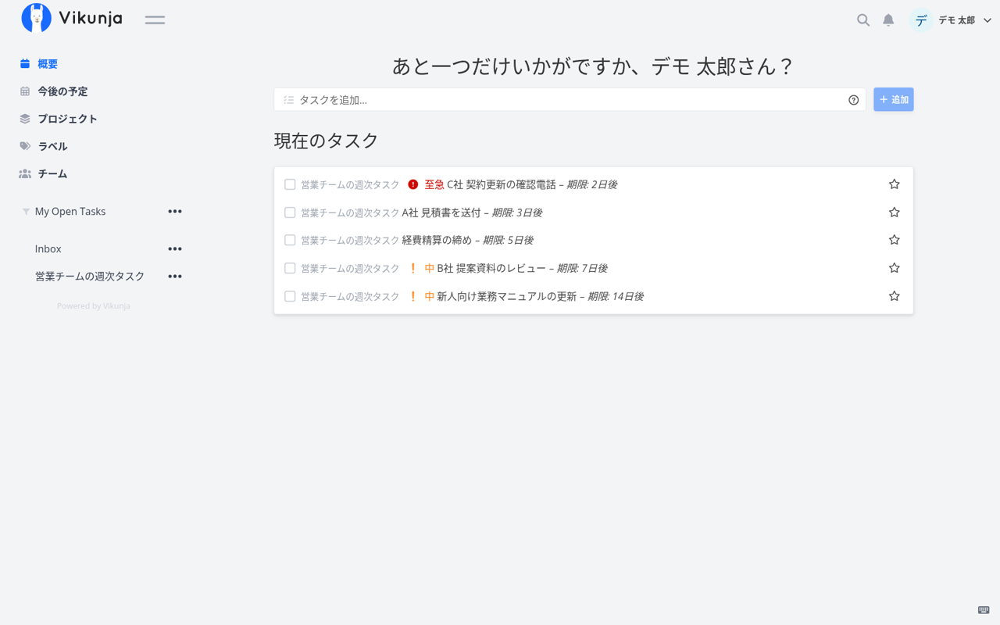
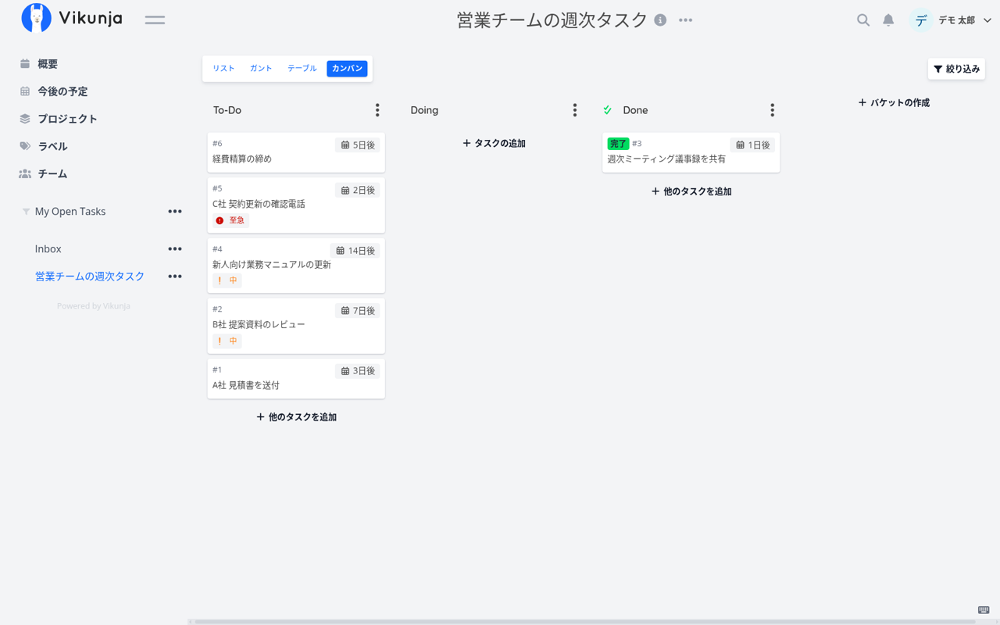
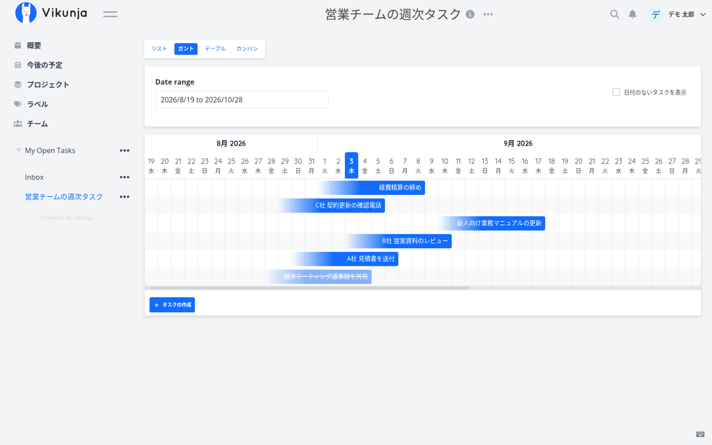
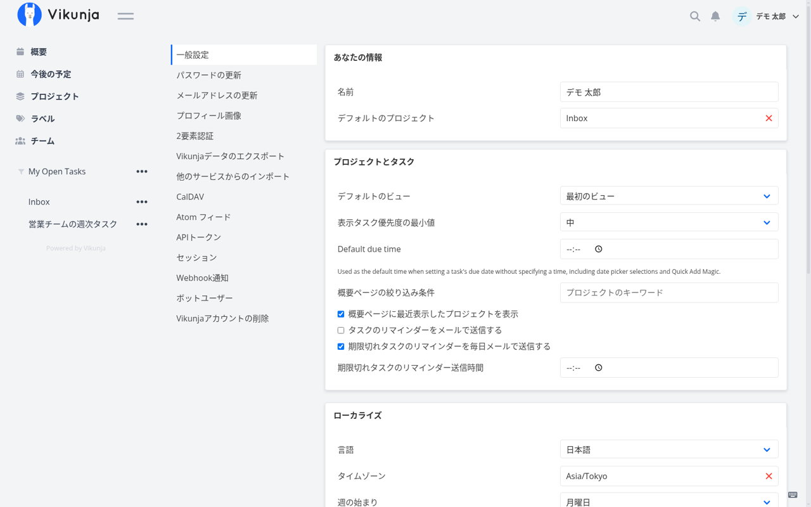

Todoist や Trello、Microsoft To-Do を「便利だけど社外にタスクを置くのが気になる」「人数課金が積み上がる」と感じている会社向けに、**自社サーバーで動くタスク管理OSS「Vikunja（ヴィクーニャ）」**を実際に立てて、日本語で使えるところまで確かめました。

結論を先に書きます。

- **docker一式で5分**で動きます（最小構成はSQLiteで、DBサーバーの用意も不要）
- **日本語UIは最初から入っており、翻訳率は91%（1,246／1,364キー）**。残り9%は画面の要所に英語のまま残ります
- 当社（名古屋のAIシステム開発会社・エクスブリッジ）は**残りの135キーを全訳し、本家の翻訳プラットフォーム（Crowdin）へ投入を進めています**。即使いたい方向けに翻訳パッチと構成ファイルは [katsushi2441/vikunja-jp](https://github.com/katsushi2441/vikunja-jp) で公開しています

数字はすべて 2026年9月3日に v2.6.0 で実測したものです。

## Vikunjaとは

[Vikunja](https://github.com/go-vikunja/vikunja) は Go 製のオープンソースタスク管理ツールです（AGPL-3.0・GitHubスター約5,250）。公式が「The task manager you actually own（本当に自分のものになるタスク管理）」と掲げているとおり、設計の中心は**自分のサーバーにデータを置くこと**にあります。

できることは、Todoist や Trello の利用者なら見慣れたものです。

- **4つのビュー**：リスト／カンバン／ガントチャート／テーブル。同じプロジェクトを切り替えて見られます
- **タスクの属性**：期限、優先度（至急〜低）、ラベル、担当者の割り当て、添付ファイル、タスク同士の関連付け、繰り返し
- **保存フィルタ**：「今週期限の至急タスク」のような条件を保存し、疑似プロジェクトとして左メニューに置けます
- **他サービスからのインポート**：Todoist・Trello・Microsoft To-Do から移行できます
- **CalDAV**：スマートフォンやThunderbirdのカレンダー・タスクアプリと同期できます（後述、実測済み）
- **チーム**：ユーザーをチームにまとめ、プロジェクト単位で共有します
- 認証は通常のユーザー登録のほか OpenID Connect と LDAP に対応します

## 5分で立てる（docker・最小構成）

公式の「Full docker example」の最小構成を土台に、公開URLと公開ポートだけ足したものが次です。DBはコンテナ内のSQLite、添付ファイルは `./files` に置きます。

```yaml
services:
  vikunja:
    image: vikunja/vikunja
    environment:
      VIKUNJA_SERVICE_PUBLICURL: http://192.168.0.3:18365/
      VIKUNJA_SERVICE_JWTSECRET: change-me-to-a-random-secret
      VIKUNJA_SERVICE_ENABLEREGISTRATION: "true"
    user: "0:0"
    ports:
      - "18365:3456"
    volumes:
      - ./files:/app/vikunja/files
      - ./db:/db
    restart: unless-stopped
```

`docker compose up -d` から画面が返るまで、当社環境では12秒でした。`PUBLICURL` は招待メールやCalDAVの案内に使われる自分のURLです。`JWTSECRET` は必ずランダムな文字列に変えてください。`user: "0:0"` は公式例のままで、ボリュームの権限トラブルを避けるための指定です（本番では専用ユーザーに変えるのが望ましい点は、後半の運用の項で触れます）。

社内で人数が増えてきたら、SQLite から PostgreSQL／MySQL に切り替えられます。環境変数 `VIKUNJA_DATABASE_TYPE` 以下を差し替えるだけで、アプリ側の操作は変わりません。

## 日本語で使う（設定は1か所）

右上のユーザー名 → 設定 → 「ローカライズ」で **言語＝日本語、タイムゾーン＝Asia/Tokyo、週の始まり＝月曜日** を選ぶだけです。デモ用に「営業チームの週次タスク」というプロジェクトと6件のタスクを入れた画面がこちらです。



カンバンでは To-Do／Doing／Done のバケット間をドラッグで動かせます。期限と優先度がカードに出ます。



ガントは日付の範囲を指定して、タスクの期間を横棒で見ます。締め切りしか入れていないタスクも、開始日を後から引き伸ばして計画に変えられます。



設定画面の左メニューには、パスワード・2要素認証・データのエクスポート・他サービスからのインポート・CalDAV・APIトークン・Webhook通知が並びます。運用で必要なものは一通り揃っています。



## 翻訳の実測：91%、残りの9%はどこに残るか

「日本語対応あり」と一言で言っても、どこまで訳されているかは使ってみないと分かりません。そこでフロントエンドの言語ファイルを直接数えました。

- 英語の原文：`frontend/src/i18n/lang/en.json` に **1,364キー**
- 日本語：`ja-JP.json` に **1,246キー**（原文と同一のまま残っているものを含めて、未訳は **135キー**）
- 翻訳率 **91%**

数字だけ見ると十分に思えますが、残った9%が画面の目立つ場所に出ます。上の画面でも、左メニューの「My Open Tasks」「Inbox」、カンバンの「To-Do／Doing／Done」、ガントの「Date range」、設定の「Default due time」とその説明文が英語のままです。ほかに未訳が集中しているのは、メールアドレス変更の確認フロー、パスワードの案内、日付表示形式の選択肢といった**初回設定と管理系のメッセージ**でした。日常のタスク操作は日本語で完結しますが、管理者が最初に触る画面ほど英語が混ざる、という分布です。

## 当社がやったこと：135キーを全訳して本家へ

1. **未訳キーの抽出**：`en.json` と `ja-JP.json` を平坦化して比較し、日本語側に無いキーと、原文と同一のまま残っているキーを機械的に拾いました（135キー）
2. **翻訳**：当社のローカルLLM（gemma4、社外にデータを出さない構成）で業務向けの です・ます調に訳し、`{count}` `{email}` のようなプレースホルダと複数形の区切り記号 `|` が**原文と1文字も違わないこと**をプログラムで検証しました（不一致0件）。固有名詞や「CalDAV」「Webhook」のように英語のまま残すべき語は残しています
3. **本家への投入**：Vikunja は「翻訳は翻訳プラットフォームで行い、PRでは受け付けない」と CONTRIBUTING に明記しています。そのため翻訳は [Crowdin の Vikunja プロジェクト](https://crowdin.com/project/vikunja) 経由で本家へ投入を進めています（進捗は vikunja-jp の README で更新します）。取り込まれれば次のリリース以降、誰の環境でも日本語で出ます
4. **今すぐ使いたい方向け**：本家反映を待たずに使えるよう、翻訳済み135キーのパッチと上記の docker 構成を [katsushi2441/vikunja-jp](https://github.com/katsushi2441/vikunja-jp) に置きました。`ja-JP.json` に上書きマージするだけで、画面の英語が消えます

「日本語が無いOSSを訳して本家に返す」という当社の取り組みは、これで Krayin（CRM、本家マージ済み）、Zammad（ヘルプデスク、Weblate 100%）に続く3本目になります。

## 会社で使うときの勘所（実測から）

**CalDAVは本当に動く**。`/dav/principals/<ユーザー名>/` に対して PROPFIND を投げると 207 Multi-Status が返り、プロジェクトがカレンダーとして見えました。iPhone の「アカウント追加 → その他 → CalDAV」やThunderbirdから、Vikunjaのタスクを既存の予定と並べて見られます。社内の「タスクは Vikunja、予定はスマホの標準カレンダー」という分業が成り立ちます。

**バックアップ対象は2つだけ**。SQLite 構成なら `./db/vikunja.db`（書き込み中は `-wal` と `-shm` も一緒に）と、添付ファイルの `./files/`。この2つを日次でコピーすれば復旧できます。PostgreSQL に移した後は、DBのダンプに置き換わります。

**最初にプロジェクトの切り方を決める**。Vikunja のプロジェクトは入れ子にできます。「部署 → 案件」のように2階層までにしておくと、保存フィルタ（例：自分が担当・今週期限・未完了）が全社横断で効きます。チーム機能はプロジェクト単位で共有するので、部署をチームに対応させるのが分かりやすい構成でした。

**公式例の `user: "0:0"` は本番では見直す**。コンテナが root で動く指定です。手元検証では便利ですが、社内の本番では専用のUID/GIDに変えて、ボリュームの所有者を合わせるのが筋です。

**登録の開放は最初だけ**。`VIKUNJA_SERVICE_ENABLEREGISTRATION` を true のまま公開すると誰でもアカウントを作れます。管理者と初期メンバーを作ったら false に戻し、以降は招待か OpenID／LDAP で入れる運用にします。

## まとめ

- Vikunja は Todoist／Trello の使い勝手を、自社サーバーで、人数課金なしで再現できます。docker 最小構成なら5分です
- 日本語は91%まで入っており、残りの9%は初回設定と管理系に集中していました。当社が135キーを全訳し、Crowdin 経由で本家への投入を進めています。即時利用向けのパッチは公開済みです
- 会社で運用するなら、CalDAV でスマホ同期、バックアップ2点、プロジェクト2階層、登録の閉鎖、root 実行の見直し——この5点を最初に決めておくと後が楽です

導入から社内展開までを、当社の手順書とテンプレート（プロジェクト設計・ラベル運用・週次の回し方・移行手順・バックアップ）にまとめた導入キットも用意しています。詳しくは [Vikunja の紹介ページ](https://kurage.exbridge.jp/oss/vikunja/) をご覧ください。

## 参考

- 本家: https://github.com/go-vikunja/vikunja （AGPL-3.0）
- 公式ドキュメント（docker 構成）: https://vikunja.io/docs/full-docker-example/
- 翻訳（Crowdin）: https://crowdin.com/project/vikunja
- 当社の翻訳パッチ・構成: https://github.com/katsushi2441/vikunja-jp
- 関連記事: [Krayin CRM の日本語化が本家にマージされるまで](2026-09-02-krayin-japanese-merged.html) ／ [Zammad の日本語を23%から100%にした記録](2026-09-03-zammad-japanese-guide.html)
