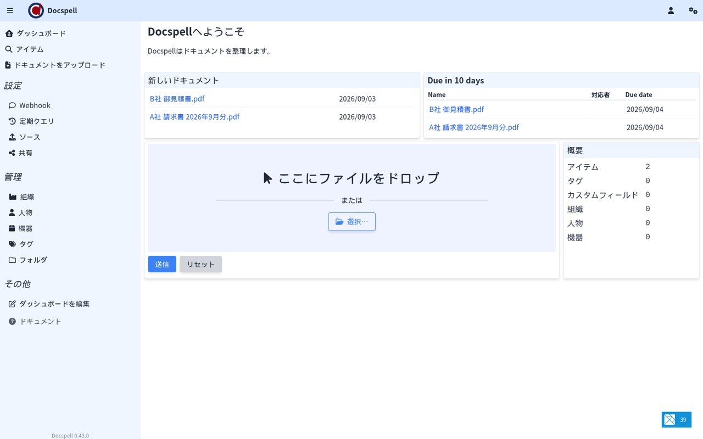
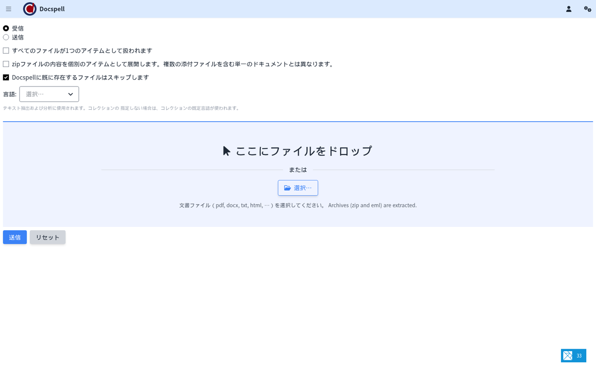
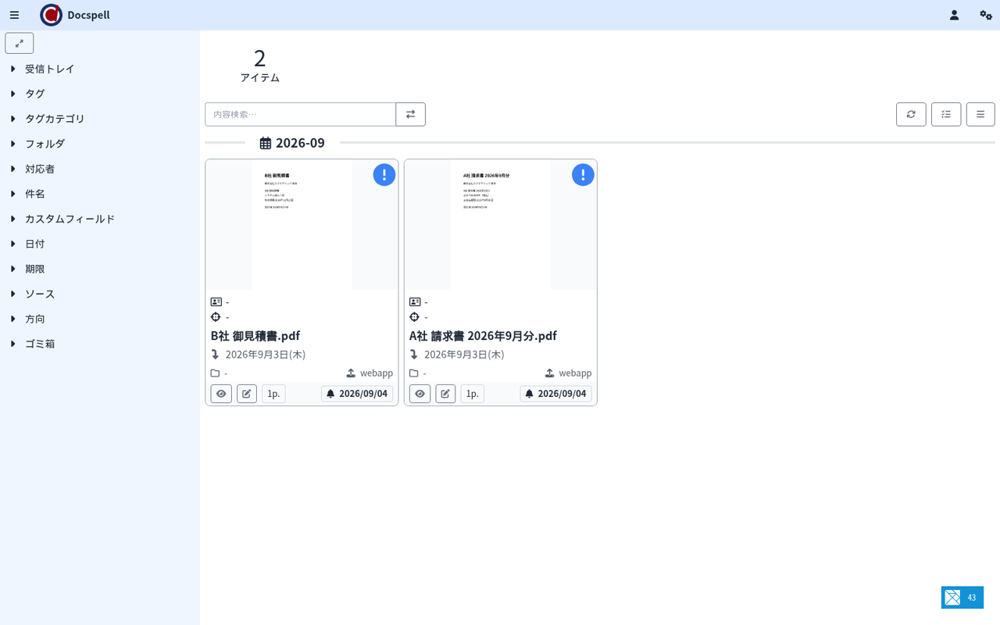

「日本語対応あり」と書いてある OSS の翻訳率を測る話をこれまで3本書きました（Vikunja 91%、Docmost 100%、Planka 88%）。今回は逆で、**日本語が一切入っていない OSS を、ゼロから日本語にした**記録です。対象は、スキャンした書類・メール添付・PDF を取り込んで整理する書類管理OSS「Docspell（ドックスペル）」。英語・ドイツ語・フランス語の3言語しかありませんでした。

結論を先に書きます。

- Docspell の画面は Elm という言語で書かれていて、翻訳ファイルではなく**プログラムのソースコードの中に**言葉が埋め込まれています。だから「翻訳ファイルを1枚足す」では終わらず、**159個のソースファイルにコードを追加**する必要がありました
- 当社（名古屋のAIシステム開発会社・エクスブリッジ）は、**1,056語を抽出して訳し、158ファイルに日本語のコードを自動生成**しました。生成したコードは Elm のコンパイラの型検査を通り、**ビルドしたアプリ本体（4.5MB）の中に日本語が入っていること**を確認しています
- 本家へは、日本語をUI言語として追加するプルリクエストの形で提案します。すぐ使いたい方向けに、翻訳データと生成スクリプトは [katsushi2441/docspell-jp](https://github.com/katsushi2441/docspell-jp) で公開します

数字はすべて 2026年9月3〜4日に、v0.43.0（公式 docker イメージ）で実測したものです。

## Docspellとは

[Docspell](https://github.com/eikek/docspell) は、紙をスキャンしたPDFやメールの添付ファイルを取り込み、OCR で文字を読み取って、日付・取引先・タグを自動で付けて整理する書類管理OSSです（AGPL-3.0・GitHubスター約2,300）。同じ分野で有名な Paperless-ngx と比べると、**メールボックスを定期的に読みに行って添付を自動取り込みする機能**と、**複数の担当者で1つの書庫を共有する設計**が特徴です。

- スキャナやフォルダ監視、メール（IMAP）から書類を自動取り込み
- OCR と全文検索（Solr）。取引先・日付・期限・タグ・カスタム項目の自動推定
- 書類同士のリンク、共有リンク、期限の通知
- 構成は本体（restserver）と処理役（joex）の2つに、PostgreSQL と Solr を組み合わせます。docker compose で5コンテナ、当社環境では起動から API 応答まで1〜2分でした

## なぜ「翻訳ファイル」では済まないのか

多くの OSS は、画面の言葉を `ja.json` のような翻訳ファイルに持っています。Vikunja も Docmost も Planka もそうで、だから「足りない分を訳して足す」で済みました。

Docspell は違います。画面は Elm で書かれ、言葉は次のように**言語ごとの関数としてソースコードに直接**書かれています。

```elm
gb : Texts
gb =
    { incoming = "Incoming"
    , outgoing = "Outgoing"
    , submit = "Submit"
    , searchPlaceholder = "Search…"
    }

de : Texts
de =
    { incoming = "Eingehend"
    ...
```

`gb`（英語）、`de`（ドイツ語）、`fr`（フランス語）の3つの定義が、画面部品ごとに159ファイルあります。日本語を足すには、**この159ファイルすべてに `ja` の定義を書き足し、さらに言語の一覧・日付の書式・言語の切り替え処理にも手を入れる**必要があります。しかも Elm は型に厳しい言語なので、1文字でも構造を間違えるとビルドが通りません。

## 当社がやったこと（3ステップ）

（1）**言葉の抽出。** 159ファイルから `gb` の定義を機械的に読み、訳すべき文字列だけを取り出しました。単純な「項目名＝文字列」の形が91ファイルで563語、関数の中に文字列が埋まっている形が60ファイルで493語。合わせて **1,056語**です。

（2）**翻訳。** 当社のローカルLLM（gemma4、社外にデータを出さない構成）で、業務用の書類管理ソフトとして自然な日本語に訳しました。「Incoming／Outgoing」は「受信／送信」、「Concerning Person」は文脈上「関係者」、といった判断を含みます。「OCR」「PDF」「SMTP」のような技術語はそのまま残し、末尾のコロンや空白が原文と一致することをプログラムで検証しました。

（3）**コードの自動生成。** ここが本題です。人手で159ファイルを書くのは現実的ではないので、`gb` の定義をそのまま複製し、**文字列の部分だけを日本語に置き換え、関数や数値はそのまま残す**生成スクリプトを書きました。他のファイルを参照している箇所（`Messages.Basics.gb` のような）は `.ja` に書き換え、日本語の木全体がつながるようにします。言語の一覧に「Japanese」を足し、日付は「2026年9月4日(木)」の形になる書式を追加しました。

結果、**158ファイルに `ja` 定義が入り、英語のまま残った語は12語**（「CalDAV」のような固有名詞を除く）。そして本家と同じビルド手順（sbt）で通し、生成された `docspell-app.js` の中に「受信」「送信」「リストに戻る」といった日本語が実際に含まれていることを確認しました。Elm の型検査は、構造が1か所でも壊れていれば全体を落とすので、**ビルドが通ってバンドルに日本語が入った時点で、生成したコードは全部正しい**ことになります。





取り込んだ書類の一覧も、日付が「2026年9月3日(木)」のように日本語の書式で出ます（これは翻訳ファイルではなく日付書式のコードを足して実現しています）。



## ビルドで踏んだ落とし穴（同じことをする人のために）

- Elm の画面をビルドするのは `sbt compile` ではなく **`sbt webapp/Compile/resources`** です。API の型定義（131ファイル）はこの過程で OpenAPI から自動生成されます
- CSS の生成に `tailwindcss` コマンドが要ります。`modules/webapp` で `npm ci` してから `node_modules/.bin` を PATH に通さないと、Elm は通っているのにスタイルの段で落ちます
- JDK 17 と sbt は coursier で入れると環境を汚しません

## 会社で使うときの勘所（実測から）

**メール取り込みは最初に設計する。** 請求書がメール添付で届く会社なら、IMAP の定期取り込み（scan mailbox）を設定して、取り込んだ後にメールを移動するか残すかを決めます。ここを曖昧にすると同じ書類が二重に入ります。

**日本語の OCR は設定で。** 取り込み時の言語（Document Language）を日本語にします。UI の言語とは別の設定です。

**バックアップは PostgreSQL と書類の実体の2つ。** Solr の索引は再作成できるので必須ではありません。

**共有リンクの扱い。** 社外に書類を見せる共有リンクは期限とパスワードを付けられます。既定で無期限にしない運用にします。

## まとめ

- Docspell は、メール添付やスキャン書類を自動で取り込んで整理する書類管理OSSです。日本語は一切ありませんでした
- 翻訳ファイルではなくソースコード（Elm）に言葉が埋まっているため、1,056語を訳して158ファイルにコードを自動生成し、本家と同じビルドで型検査を通しました
- 「日本語が無いOSSを訳して本家に返す」取り組みは、Krayin（本家マージ済み）、Zammad、Vikunja、Planka に続いて、これが最も重い1本です。翻訳ファイルが無くても、生成で日本語化できることが分かりました

導入から社内展開までを、当社の手順書（メール取り込み設計・OCR 言語・バックアップ・共有ルール）にまとめた導入キットも用意しています。詳しくは [Docspell の紹介ページ](https://kurage.exbridge.jp/oss/docspell/) をご覧ください。

## 参考

- 本家: https://github.com/eikek/docspell （AGPL-3.0）
- docker 構成（公式）: https://github.com/docspell/docker
- 当社の翻訳・生成スクリプト: https://github.com/katsushi2441/docspell-jp
- 関連記事: [Vikunja](2026-09-03-vikunja-japanese-guide.html) ／ [Docmost](2026-09-03-docmost-japanese-guide.html) ／ [Planka](2026-09-04-planka-japanese-guide.html)
