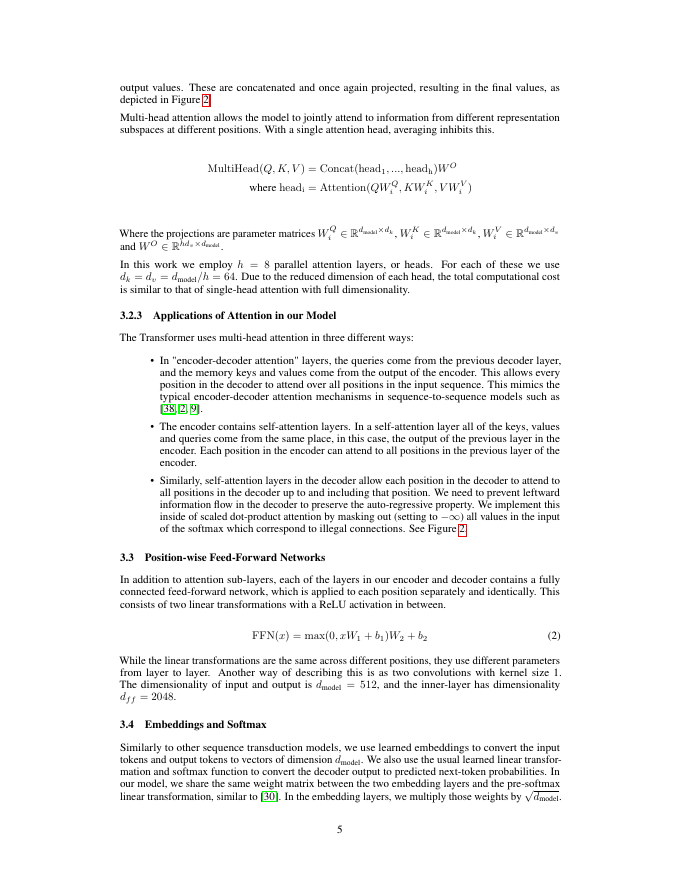
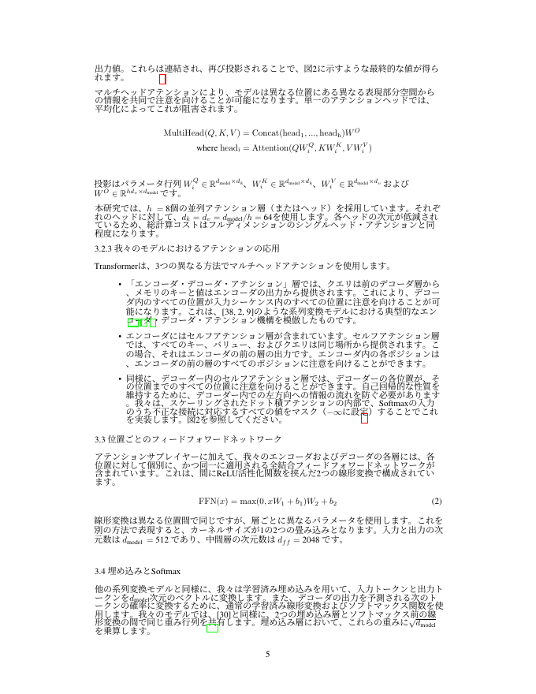

英語の仕様書や論文を日本語で読みたい。ただし**その文書をクラウドの翻訳サービスに送りたくない**。技術資料、未公開の仕様書、契約書を扱う会社では、これが導入の壁になります。

オープンソースの [PDFMathTranslate](https://github.com/Byaidu/PDFMathTranslate)（コマンド名 `pdf2zh`・AGPL-3.0・GitHubスター約36,700）を自社サーバーに立てて、翻訳エンジンも自社のGPUで動かし、**文書が一度も社外に出ない構成**で実測しました。

結論を先に書きます。

- 英語の学術論文15ページ（2.2MB・数式と表つき）を **179秒（約3分）** で日本語化。1ページ11秒
- 追加費用は **0円**。従量課金のAPIを使っていません
- **数式・図表・箇条書き・節番号・式番号・引用番号がすべて保たれました**
- 思考型モデルを使う場合、設定ひとつで **5.8倍**（81秒→14秒／ページ）変わります
- `pip install` しただけでは**起動しません**（依存パッケージの破壊的更新）。回避方法も書きます

## 何をする道具か

PDFMathTranslate は「PDFのレイアウトを解析して、本文だけを翻訳エンジンに渡し、元の位置に訳文を流し込む」道具です。翻訳そのものはしません。**翻訳エンジンは選べます**。ここが要点で、選び方で機密性と費用が決まります。

| エンジン | 文書が社外に出るか | 費用 | 品質 |
|---|---|---|---|
| 自社サーバーのローカルLLM（Ollama） | 出ない | 0円 | 高い |
| 完全オフライン（Argos Translate・MIT） | 出ない | 0円 | 中程度 |
| DeepL / OpenAI 等 | 出る | 従量課金 | 高い |
| Google 翻訳（**既定**） | 出る | 無料 | 中程度 |

既定が Google 翻訳なので、何も指定せずに社内文書を流すと外に出ます。最初に決めるべきはここです。

## 結果を見てください

原文（英語）と、翻訳後の同じページです。





`MultiHead(Q,K,V) = Concat(head₁,...,headₕ)W^O` のような数式が、LaTeX組版のまま残っています。式番号 (2)、節番号 3.3・3.4、箇条書きの階層、引用番号もそのままです。訳文だけが日本語に置き換わっています。

## 実測

サーバーは当社のLinux機、翻訳エンジンは同じ社内ネットワークのGPU1枚（Ollama・12Bのモデル）です。

| 項目 | 実測 |
|---|---|
| 対象 | 英語の学術論文 15ページ・2.2MB |
| 全体の所要 | **179秒** |
| 1ページあたり | 11秒（ページごとに4〜17秒） |
| 翻訳された日本語 | 9,783文字 |
| 出力 | 日本語版（15ページ）と対訳版（30ページ） |
| 追加費用 | 0円 |

ページごとの日本語文字数はこうなりました。

```
p1:499  p2:1475 p3:695  p4:828  p5:1107
p6:1109 p7:1120 p8:946  p9:879  p10:696
p11:53  p12:0   p13:128 p14:126 p15:124
```

12ページ目が0なのは、そのページが図版だけだからです。11ページ目以降が少ないのは参考文献リストです。**本文のページはすべて翻訳されていました。**

## 罠1: `pip install` しただけでは起動しない

まずこれで止まります。

```
ImportError: cannot import name 'TextTranslateRequest'
  from 'tencentcloud.tmt.v20180321.models'
```

pdf2zh は翻訳エンジンの1つとして Tencent の翻訳APIに対応していて、そのSDK `tencentcloud-sdk-python-tmt` に**バージョン指定なし**で依存しています。2026年7月7日に出た 3.1.129 でクラス構成が変わり、pdf2zh が参照している `TextTranslateRequest` が消えました。Tencent の翻訳を使うつもりが無くても、**import の時点で落ちます**。

対処は1行です。当社が動作を確認したのは 3.1.121 です。

```bash
pip install pdf2zh
pip install "tencentcloud-sdk-python-tmt==3.1.121"
pdf2zh --version   # pdf2zh v1.9.11
```

新しく入れる人ほど踏むので、最初に書いておきます。

## 罠2: 思考型モデルで5.8倍遅くなる

最近のモデルは「思考型」で、答える前に内部で長い推論を書きます。Ollama では `think` パラメータで止められますが、**pdf2zh はこれを送っていません**。

pdf2zh のソースを読むと、応答から `<think>...</think>` を正規表現で削る処理は入っています。DeepSeek-R1 のように思考をタグで囲んで出すモデルは想定されています。しかし、Ollama がネイティブに扱う思考（タグではなくAPIのパラメータで制御するもの）は止まりません。見えない推論トークンが生成され、その分だけ遅くなります。

同じページ・同じモデル・同じGPUで測りました。

| 設定 | 1ページの所要 |
|---|---|
| 既定のまま（思考が有効） | **81秒** |
| `think=False` を渡す | **14秒** |

**5.8倍**です。訳文の品質は変わりませんでした。日本語の文字数は 39,014 と 39,006 でほぼ一致し、訳語の選択も同水準です。速度だけが変わります。

対処は、pdf2zh の Ollama 接続部分に1行足すだけです。

```python
response = self.client.chat(
    model=self.model,
    messages=self.prompt(text, self.prompt_template),
    options=self.options,
    think=False,   # ← これ
)
```

**注意点として、pdf2zh を更新するとこの修正は消えます。** 依存のバージョン固定も同時に消えるので、更新のたびに両方当て直す必要があります。

## 罠3: 出力先ディレクトリは自動で作られない

`-o out` を指定して `out` が存在しないと、**翻訳を全部終えた後に**この例外で落ちます。

```
FileNotFoundError: [Errno 2] No such file or directory: 'out/xxx-mono.pdf'
```

長い文書だと数分が無駄になります。実行前に `mkdir -p out` を必ず入れてください。

## 罠4: 言語とページ指定

- **`-lo ja` を忘れると中国語になります。** この道具はもともと英語→中国語向けに作られていて、出力先の既定が中国語です
- **`-p 3` は「3ページ目だけ」で、「1〜3ページ」ではありません。** 当社はここを取り違えて速度の測定をやり直しました。範囲で指定したいときは `-p 1,2,3` です

## 完全オフラインという選択肢

GPUが無い場合は、Argos Translate（**MITライセンス**・CPUのみ・ネットワーク不要）を選べます。モデルの導入は4秒で終わりました。

```bash
pip install argostranslate
python -c "
import argostranslate.package as p
p.update_package_index()
pkg=[x for x in p.get_available_packages() if x.from_code=='en' and x.to_code=='ja'][0]
p.install_from_path(pkg.download())"
```

品質は落ちます。同じ英文で比べました。

原文: *The Transformer allows for significantly more parallelization and can reach a new state of the art in translation quality.*

| エンジン | 出力 |
|---|---|
| ローカルLLM（12B） | Transformerは、はるかに高い並列化を可能にし、翻訳品質において新たな最高水準に到達できます。 |
| Argos（オフライン） | トランスは、より多くの並列化を可能にし、翻訳品質の新しい状態に到達することができます。 |

Argos は「Transformer」を「トランス」と訳し、"state of the art" を直訳しています。**固有名詞と専門用語が崩れる**のがオフライン翻訳の弱点です。用語集で補うか、GPUを用意するかの判断になります。

## ライセンスの線引き

PDFMathTranslate は **AGPL-3.0** です。

- 自社サーバーに置いて自社の社員が使う: **ソースの公開義務はありません**
- 改変して自社で使う: 同上
- 改変版を**社外にネットワーク越しのサービスとして提供する**: ソースの公開義務が生じます

多くの会社が想定するのは1つ目と2つ目なので問題になりませんが、社外向けの翻訳サービスとして開放するなら確認が要ります。翻訳した成果物のPDFにこのライセンスは及びません（原文の著作権と翻訳権は別途確認してください）。

## 何が保たれ、何が崩れるか

15ページの論文で確認した結果です。

**保たれたもの**: 数式（複雑な式も）、式番号、節番号、図・表の位置と画像、引用番号、箇条書きの階層

**崩れやすいもの**: 縦に1文字ずつ配置された領域（表紙の縦書きIDなど）、2段組の段またぎの文、参考文献リストの一部、**スキャンした画像だけのPDF（そもそも翻訳できません）**

スキャンPDFかどうかは `pdftotext doc.pdf - | head` で分かります。何も出なければ画像だけなので、先にOCRが必要です。

## まとめ

- 英語PDFの翻訳は、レイアウトを保ったまま、文書を社外に出さずに、追加費用0円でできます。15ページで約3分でした
- 導入時に踏む罠が4つあります。依存の固定、思考型モデルの設定、出力先ディレクトリ、言語とページの指定
- GPUが無ければ完全オフライン（MIT）も選べますが、固有名詞が崩れます

導入から社内展開までを、当社の手順書8章・テンプレート5点・スクリプト5本にまとめた **[PDFMathTranslate 日本語導入・運用キット（税込5,500円）](https://kappstore.exbridge.jp/app.php?id=8adb859f30cb8cc5&ref=vwork-pdf2zh)** も用意しています。上の4つの罠の対処、翻訳エンジンの選定表、用語集による訳語の統一、一括翻訳と品質チェックのスクリプト、社内公開時の認証・アップロード上限・タイムアウトまで含みます。

## 参考

- PDFMathTranslate: https://github.com/Byaidu/PDFMathTranslate （AGPL-3.0）
- Argos Translate: https://github.com/argosopentech/argos-translate （MIT）
- 翻訳に使った原文: [Attention Is All You Need (arXiv:1706.03762)](https://arxiv.org/abs/1706.03762)
- 関連記事: [whisper.cppの日本語文字起こし実測](2026-09-04-whisper-cpp-japanese-transcription.html)／[Fess×ローカルLLMで社内PDFに答える](2026-09-04-fess-fulltext-search-ai-chat.html)
