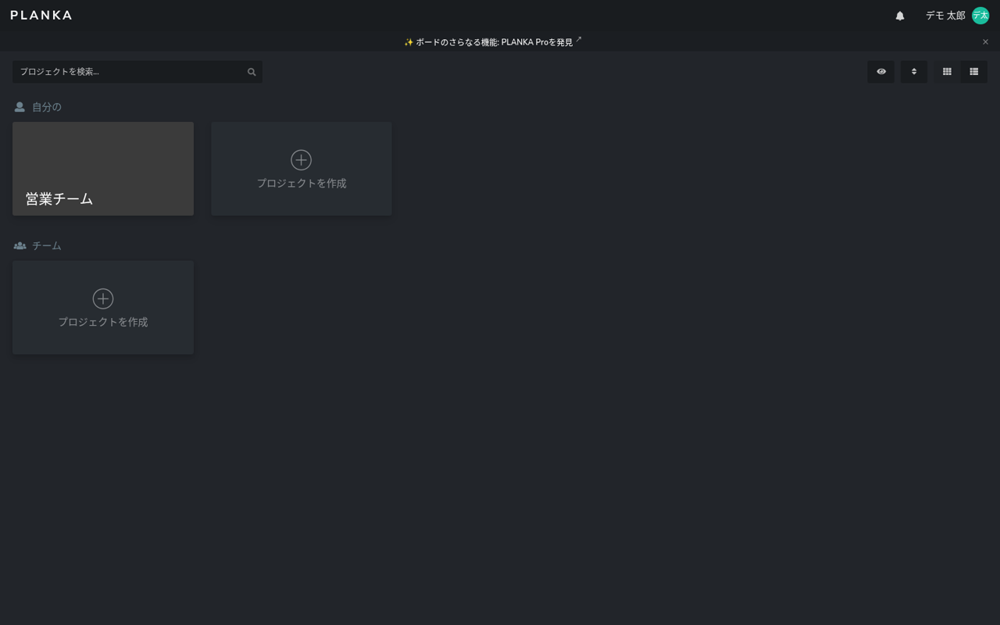
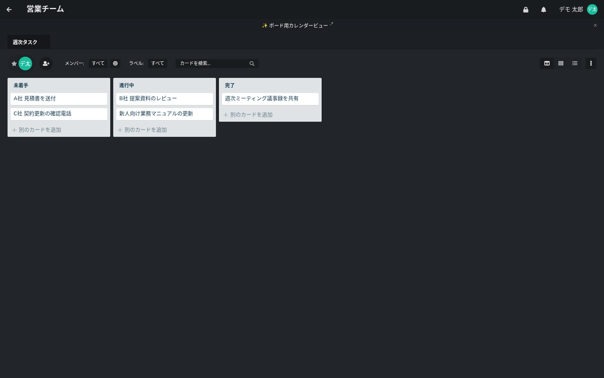

Trello の月額をやめて、同じ使い勝手のカンバンを自社サーバーに置きたい。その候補として名前がよく挙がる **Planka（プランカ）** を、実際に立てて日本語で使えるところまで確かめました。結論を先に書きます。

- **docker 2コンテナで数分**で動きます（本体＋PostgreSQL）。初回ログイン時に利用規約への同意が必要で、ここはAPIから使う場合にも通ります（後述）
- **日本語UIは最初から入っており、翻訳率は約88%（483キー中、未訳56キー）**。自動ログアウトや2要素認証など、新しめの機能の言葉が英語のまま残っています
- 当社（名古屋のAIシステム開発会社・エクスブリッジ）は**残りの56キーを全訳**し、翻訳パッチと docker 構成を [katsushi2441/planka-jp](https://github.com/katsushi2441/planka-jp) で公開しています。本家へはプルリクエストで提案します（Planka は翻訳のPRを受け付けています）
- **ライセンスに線引きがあります**。Planka は「PLANKA Community License」という独自ライセンスで、自社の内部利用や自社ホスティングは無償ですが、**第三者向けにホスティングして提供する用途は商用ライセンスが必要**です。導入前に必ず確認してください

数字はすべて 2026年9月4日に、公式の docker イメージ（`ghcr.io/plankanban/planka:latest`）で実測したものです。

## Plankaとは

[Planka](https://github.com/plankanban/planka) は、Trello と同じ「プロジェクト → ボード → リスト → カード」の構造を持つカンバン型のタスク管理OSSです（GitHubスター約12,500・JavaScript製）。

- カードに担当者、ラベル、期限、チェックリスト、添付、コメントを付けられる
- 同じボードを開いている人の操作がリアルタイムで反映される
- 通知（公式は100以上の通知先に対応と案内）、Markdown でのカード説明

画面は Trello をそのまま自社に置いたような操作感で、初めての人でも説明がほぼ要りません。Trello からの移行については、当社ではボードの書き出しからの再作成で対応しています（本家のインポート機能の有無・対応範囲は版によって変わるため、導入時に実機で確認します）。

## 数分で立てる（docker・公式構成）

公式リポジトリの `docker-compose.yml` をそのまま使い、公開URL・秘密鍵・初期管理者を書き換えます。

```yaml
services:
  planka:
    image: ghcr.io/plankanban/planka:latest
    environment:
      - BASE_URL=https://kanban.example.co.jp    # 社員がアクセスするURL(重要・後述)
      - DATABASE_URL=postgresql://postgres@postgres/planka
      - SECRET_KEY=openssl rand -hex 32 の出力
      - DEFAULT_ADMIN_EMAIL=admin@example.co.jp   # 初期管理者(初回起動時に作られる)
      - DEFAULT_ADMIN_PASSWORD=change-me
      - DEFAULT_ADMIN_NAME=管理者
      - DEFAULT_ADMIN_USERNAME=admin
    ports: ["3000:1337"]
    depends_on: [postgres]
  postgres:
    image: postgres:16-alpine
```

**`BASE_URL` は必ず実際にアクセスするURLと一致させてください。** 当社の検証で一度、内部IPで起動して別のホスト名で開いたところ、ログインは通るのに画面が真っ白のまま、という状態になりました。Planka のフロントエンドは `BASE_URL` に向けてAPIと通知用のソケットをつなぐため、開いたURLと食い違うと通信が別オリジン扱いになって静かに止まります。エラーも出ません。ここは docker で立てる人が最初に踏む落とし穴です。

## 初回ログインと「利用規約への同意」

初期管理者で最初にログインすると、利用規約への同意画面が出ます。画面から使うぶんには「同意」を押すだけですが、**APIから使う場合は少し手順が要ります**。ログインAPI（`POST /api/access-tokens`）は同意前だと 403 と `pendingToken` を返し、`GET /api/terms` で規約と署名を取り、`POST /api/access-tokens/accept-terms` に `pendingToken` と署名を送ると本当のトークンが返ります。当社では移行スクリプトや自動化でこの経路を通しました。

## 日本語で使う

右上のユーザー名 → 設定 → 言語で **日本語** を選びます。言語はユーザーごとの設定です。デモとして「営業チーム」プロジェクトに「週次タスク」ボードを作り、未着手／進行中／完了の3リストに5枚のカードを入れた画面がこちらです。





## 翻訳の実測：約88%、残りはどこに残るか

「日本語対応あり」の中身を、言語ファイルを直接数えて確かめました。英語の原文 `client/src/locales/en-US/core.js` に **483キー**、日本語 `ja-JP/core.js` にはそのうち **427キー**。**56キーが未訳**です。

未訳が集中しているのは次のような場所でした。

- **自動ログアウト**の設定（10分／30分／12時間／しない、と警告文）
- **2要素認証（2FA）**の有効化・無効化まわり
- パスワード確認、確認コードの保存、といった**認証・セキュリティ系の新しめの画面**

日々のカード操作は日本語で完結しますが、管理者がセキュリティ設定を触るときに英語が混ざる、という分布です。Vikunja のときも同じ傾向で、**「新しく追加された機能ほど翻訳が追いついていない」**のはOSS共通です。

## 当社がやったこと：56キーを全訳して本家へ

1. **未訳キーの抽出**：英語と日本語の `core.js` をキー単位で突き合わせ、日本語側に無い56キーを機械的に拾いました
2. **翻訳**：当社のローカルLLM（gemma4、社外にデータを出さない構成）で業務向けに訳し、`{{name}}` のような差し込み部分が原文と1文字も違わないことをプログラムで検証しました。「10分後」「2要素認証を無効にする」など、画面の文脈に合う短い日本語にしています
3. **公開と本家への提案**：翻訳パッチと、本家の `ja-JP/core.js` に追記するスクリプトを [katsushi2441/planka-jp](https://github.com/katsushi2441/planka-jp) に置きました。Planka は翻訳の追加をプルリクエストで受け付けているので、本家へも提案します。取り込まれれば、次のリリース以降は誰の環境でも日本語で出ます

## 会社で使うときの勘所（実測から）

**ライセンスを最初に確認する。** Planka の Community License（v1.1）は、個人・教育目的、**自社組織内での利用、自社のためのホスティング**は無償です。一方で、**Planka をホスティングして第三者にサービスとして提供する**用途や、組織をまたいだアカウント共有は商用ライセンスが必要と明記されています。自社の業務で使うぶんには問題ありませんが、「お客様向けに Planka を立ててあげる」形はライセンス違反になります。当社がお手伝いするときも、**お客様自身の組織内利用として、お客様のサーバーに立てる**形に限っています。

**`BASE_URL` は本番のURLに合わせ、HTTPSにする。** 上の白画面の件です。リバースプロキシ（nginx）を前に置くなら、通知用の WebSocket を通す設定が要ります。

**バックアップは2つ。** PostgreSQL のダンプと、添付ファイルのボリューム。この2つを日次で取れば復旧できます。

**プロジェクト＝部署、ボード＝案件や期間。** Trello と同じ切り方で困りません。ラベルは全社で共通の10個以内に絞ると、フィルタが効きます。

## まとめ

- Planka は Trello の使い勝手を、自社サーバーで、人数課金なしで再現できます。docker なら数分です
- 日本語は約88%。残りの56キー（自動ログアウト・2FA・認証系）を当社が全訳し、パッチを公開・本家へ提案しています
- `BASE_URL` の不一致で白画面になる落とし穴と、「第三者向けホスティングは商用ライセンス」というライセンスの線引きだけは、導入前に押さえてください

導入から社内展開までを、当社の手順書とテンプレート（ボード設計・ラベル規約・移行手順・バックアップ・ライセンス確認表）にまとめた導入キットも用意しています。詳しくは [Planka の紹介ページ](https://kurage.exbridge.jp/oss/planka/) をご覧ください。

## 参考

- 本家: https://github.com/plankanban/planka （PLANKA Community License v1.1／商用ライセンスあり）
- 翻訳パッチ・docker構成: https://github.com/katsushi2441/planka-jp
- 関連記事: [Vikunja（タスク管理）の導入と翻訳の穴を埋めた記録](2026-09-03-vikunja-japanese-guide.html) ／ [Docmost（社内Wiki）の日本語検索の穴と対策](2026-09-03-docmost-japanese-guide.html)
