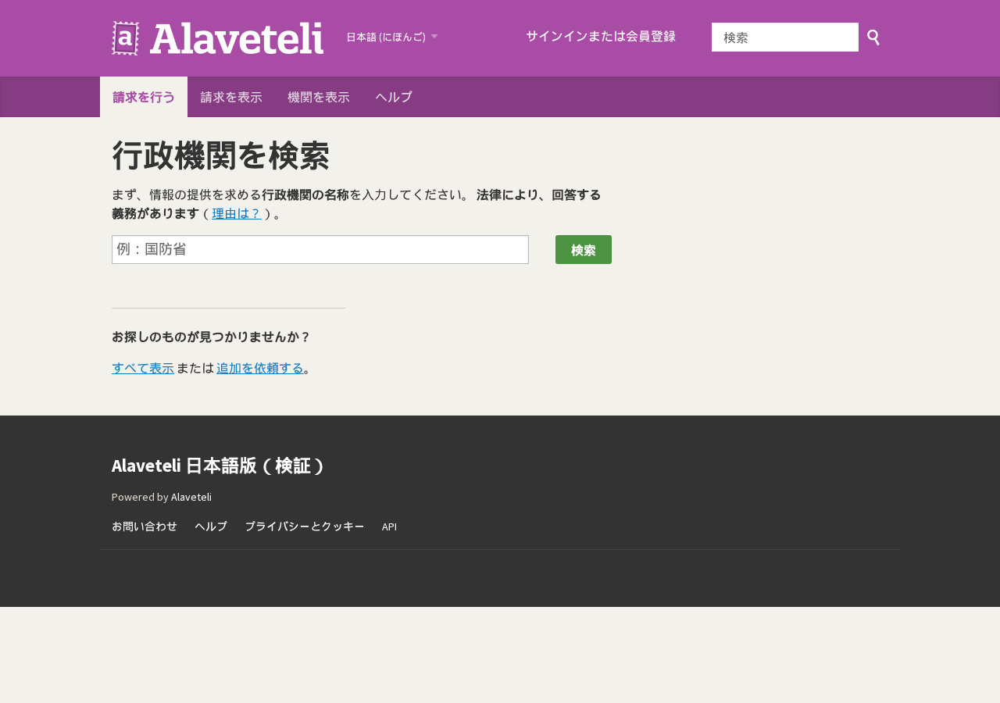

日本の情報公開請求（行政文書の開示請求）はきちんと機能している制度ですが、**「誰が何を請求して、何が開示されたか」が共有されません**。同じ文書を別々の人が何度も請求し、開示された文書は請求者の手元で止まります。英国はこれを2008年に WhatDoTheyKnow というサイトで解きました。請求文も回答もサイト上で公開され、次の人はそれを読んでから請求する。そのソフトウェアがオープンソースの **Alaveteli**（mySociety・AGPL-3.0・GitHubスター400超）です。

Alaveteli は70前後の言語に翻訳されていましたが、日本語はありませんでした。全文を日本語化し、公式の Docker 環境で日本語既定の画面が出るところまで動かし、本家に Pull Request を出しました。[FixMyStreet の日本語化](2026-09-07-fixmystreet-japanese-guide.html)と同じ日の、同じ手順の2本目です。

## できあがったもの

- 日本語版リポジトリ: https://github.com/katsushi2441/alaveteli-jp （非公式。`jp` ブランチが既定）
- 本家への PR: https://github.com/mysociety/alaveteli/pull/9527
- 導入キット（手順書・AI指示書）: https://kappstore.exbridge.jp/app.php?id=025aa9bee5dd411e




## 1. 翻訳——1,553文字列、`{{name}}` 形式のプレースホルダ

Alaveteli の文言は gettext の `locale/app.pot`（1,553 msgid）で、プレースホルダは FastGettext の `{{name}}` 形式です。`locale/ja/app.po` を起こし、ローカルの gemma4（12B）で8件ずつ訳しました。守らせたのは FixMyStreet と同じ3つ——`{{…}}`・HTMLタグ・実体参照・URL・改行を一字も変えない（訳文側を機械抽出して原文と一致しなければ不採用）、用語を固定する、先頭・末尾の空白を原文に合わせる——です。

用語は日本の制度に寄せました。request＝請求、public authority＝行政機関、requester＝請求者、successful＝開示、refused＝不開示、partially successful＝一部開示、awaiting response＝回答待ち、overdue＝期限超過、annotation＝コメント。

結果は 1,467/1,553（94.5%）。残り86件は「Keep it <strong>focused</strong>」のような `<strong>` が入れ子になったヘルプ文で、LLM が毎回タグを崩すため、人が直す前提で本家にはそのまま出しました。約30分です。

## 2. 起動——公式 Docker と3行の設定

本家には開発用の Docker 構成（`./docker/setup` → `./docker/server`）があります。Ruby イメージの構築と gem のインストールで初回は10〜20分。ポート 3000 が他のサービスと衝突したので override で 18383 にしました。

日本語を既定にするのは `config/general.yml` の3行です。

```yaml
AVAILABLE_LOCALES: 'ja en'
DEFAULT_LOCALE: 'ja'
SITE_NAME: '情報公開請求アーカイブ（検証）'
```

翻訳ファイルは起動時に読み込まれるので、差し替えたら `docker compose restart app sidekiq`。トップに「すべての市民には、行政機関が保有する情報にアクセスする権利があります」と出れば成功です。

踏んだ穴は、compose が `../alaveteli-themes` を相対パスでマウントするので空ディレクトリを作っておかないと起動しないこと、開発用の smtp コンテナがダミーなので請求メールは外に出ないこと、の2つでした。

## 3. 日本で使うときの現実

英国流は「サイトから行政機関にメールで請求し、回答メールがそのままサイトに載る」です。日本の自治体は書面・押印や写しの実費を求めるところが多く、メールでの請求を受け付けない機関があります。名古屋市は電子申請（Graffer）から請求できますが、それでも回答はサイトに自動では戻りません。

現実的な使い方は2つです。

1. **請求アーカイブ**: 請求は正規の方法で出し、請求文と開示文書を Alaveteli に載せて公開する。次の人が書き方と結果を読める
2. **議員事務所・政党の透明性**: 自分の請求と回答を公開し、「調べています」を住民が確かめられる形にする

## 4. 残っていること

- **本番運用**: 公式 Docker は開発用です。HTTPS・SMTP/IMAP（請求の送信と回答の受信）・バックアップは別途
- **翻訳の残り86件**: ヘルプ文。本家のレビューで直してもらう前提
- **Transifex**: mySociety の正式窓口。PR で受けてもらえなければ載せ替えます

## まとめ

- 日本語化: 1,467/1,553。プレースホルダは機械検証、本家に PR #9527
- 起動: 公式 Docker＋`general.yml` の3行＋再起動
- 日本での使い方は「請求アーカイブ」と「事務所の透明性」

導入キット（手順書・落とし穴6個・AI指示書）は Kurage App Store で 5,500円（税込）です: https://kappstore.exbridge.jp/app.php?id=025aa9bee5dd411e ／ 解説LP: https://kurage.exbridge.jp/johokokai-seikyu.php
