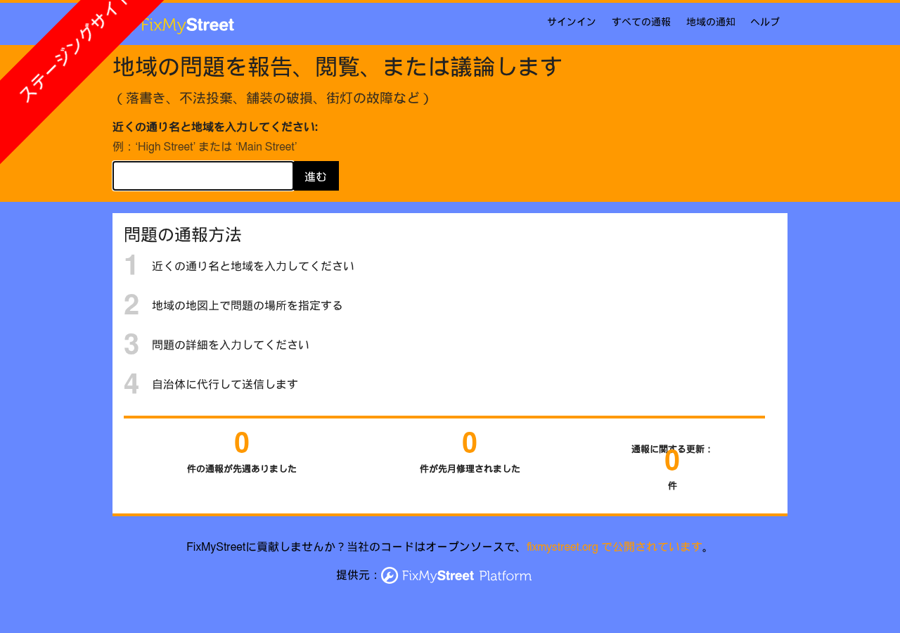

「道路に穴が空いている」「不法投棄がある」「街灯が切れている」。住民がスマホで写真と場所を送ると担当部署へ回り、対応状況が地図で公開される——千葉市の「ちばレポ」で知られる仕組みは、英国では2007年から **FixMyStreet** というオープンソース（mySociety・AGPL-3.0・GitHubスター600超）として動いています。名古屋市の公式LINEにも「道路公園損傷通報」がありますが、対象は道路と公園だけで、対応状況の公開もありません。

FixMyStreet には日本語がありませんでした（locale は40言語、ja なし）。そこで全文を日本語化し、公式 Docker イメージで名古屋市の地図上に日本語の通報フォームが出るところまで動かし、本家に Pull Request を出しました。この記事はその実録です。

## できあがったもの

- 日本語版リポジトリ: https://github.com/katsushi2441/fixmystreet-jp （非公式。`jp` ブランチが既定）
- 本家への PR: https://github.com/mysociety/fixmystreet/pull/6131
- 導入キット（手順書・設定・SQL・AI指示書）: https://kappstore.exbridge.jp/app.php?id=b34e36cfaad27a14




## 1. 翻訳——1,456文字列をローカルLLMで訳して機械検証

FixMyStreet の文言は gettext の `locale/FixMyStreet.po`（1,456 msgid）にまとまっています。これを `locale/ja_JP.UTF-8/LC_MESSAGES/FixMyStreet.po` として起こし、ローカルの gemma4（12B）で8件ずつ訳しました。

守らせたのは次の3つです。

1. `%s` `%d` `%%`、HTMLタグ、`&ndash;` などの実体参照、URL、改行を**一字も変えない**。訳文側のこれらを機械的に抽出して原文と一致しなければ不採用
2. 用語を固定する（report=通報、council/body=自治体/対応機関、category=分類、update=更新、alert=通知）
3. 先頭・末尾の空白は原文に合わせて補正する（`" and "` のような接続語が多い）

結果は 1,409/1,456（96.8%）。残り47件は管理画面のヘルプ文で、`<strong>` と実体参照が入り組んでいて LLM が毎回タグを崩すため、人が直す前提で本家にはそのまま出しました。全体で20分ほどです。

## 2. 起動——公式 Docker イメージにロケールを足す

公式の `docker-compose.yml`（`fixmystreet/fixmystreet:stable`・nginx・PostgreSQL・memcached）をそのまま使い、override でポートと設定ファイルを差し替えます。

```yaml
# docker-compose.override.yml
services:
  nginx:
    ports: !override
      - "18382:80"
  fixmystreet:
    volumes:
      - ./conf/general.yml-jp:/var/www/fixmystreet/fixmystreet/conf/general.yml
      - ./locale/ja_JP.UTF-8:/var/www/fixmystreet/fixmystreet/locale/ja_JP.UTF-8
```

`general.yml-jp` では `LANGUAGES` の先頭に `ja,Japanese,ja_JP` を置きます。ここで **3つ揃わないと英語のまま** です。

```bash
docker compose exec fixmystreet bash -lc '
  echo "ja_JP.UTF-8 UTF-8" >> /etc/locale.gen && locale-gen
  cd /var/www/fixmystreet/fixmystreet && commonlib/bin/gettext-makemo
  systemctl restart fixmystreet'
```

イメージには日本語のシステムロケールが無い（`locale-gen` が要る）、`.po` は `.mo` にコンパイルしないと読まれない（`gettext-makemo`）、アプリはコンテナ内の systemd が管理していて再起動が要る——この3つです。`docker-compose.yml` の `cgroup: host` と `/sys/fs/cgroup` のマウントはこの systemd のためのもので、消すと起動しません。

## 3. 日本の行政境界——MapIt Global で名古屋の「市」と「区」が引ける

FixMyStreet は緯度経度から「どの自治体の管轄か」を **MapIt** という境界サービスに問い合わせます。公式 Docker の既定は `fakemapit`（偽物）で、何も引けません。mySociety が OpenStreetMap の行政境界で運用している **MapIt Global** に切り替えると、日本も引けました。

```
https://global.mapit.mysociety.org/point/4326/136.9066,35.1815
→ 中区 (O08) / 名古屋市 (O07) / 愛知県 (O04) / 日本 (O02)
```

`MAPIT_URL: 'https://global.mapit.mysociety.org/'`、`MAPIT_TYPES: [ 'O07', 'O08' ]` にして再起動。API キー無しで通りました（大量に叩く本番運用は利用条件の確認が要ります）。

## 4. 対応機関と分類——管理画面か SQL で

通報は「対応機関（body）」に紐づく「分類（category）」を選んで送られます。`bin/createsuperuser` で管理者を作り `/admin/bodies` から登録できますが、ログイン画面のパスワード欄が折りたたまれていて自動化しづらかったので、DB に直接入れる SQL も用意しました。

```sql
INSERT INTO body (name) VALUES ('名古屋市');
INSERT INTO body_areas (body_id, area_id) SELECT id, 989637 FROM body WHERE name='名古屋市';
INSERT INTO contacts (body_id, category, email, state, editor, whenedited, note)
SELECT id, c, 'doboku@example.org', 'confirmed', 'kit', now(), '' FROM body,
  (VALUES ('道路の穴・舗装の破損'),('不法投棄'),('街路灯の故障')) AS t(c) WHERE name='名古屋市';
```

再起動後、`/report/new?latitude=35.1815&longitude=136.9066` を開くと名古屋市役所付近の地図が出て、分類3件が日本語で並び、「次へ」で詳細入力に進めました（冒頭のスクリーンショット）。

## 5. 残っていること

- **メール送信**: 通報を担当部署へ飛ばすには `SMTP_SMARTHOST` の設定が要ります。未設定でも通報は DB に溜まります
- **公開**: VPS のリバースプロキシ（Caddy が楽）と `BASE_URL`。共有レンタルサーバーでは動きません（Perl＋PostgreSQL＋systemd）
- **翻訳の残り47件**: 管理画面のヘルプ文。本家のレビューで直してもらう前提です
- **Transifex**: mySociety は翻訳の正式窓口を Transifex にしています。PR で受けてもらえなければそちらに載せ替えます

## なぜ議員事務所か

自治体にはすでに LINE 通報がある場合があります。一方で、議員事務所や政党支部には「住民の困りごとを受けて役所につなぐ」仕事が毎日あり、受けた内容と進捗を公開する道具がありません。FixMyStreet は対応機関を「事務所」にして、通報先を事務所のメールにすれば、そのまま**事務所の困りごと受付・追跡システム**になります。住所を入れると答えが返る[通報先ナビ](https://kurage.exbridge.jp/kecnavi.php/?ref=vwork-fms)の次の段として作りました。

## まとめ

- 日本語化: 1,409/1,456。プレースホルダは機械検証、本家に PR #6131
- 起動: 公式 Docker＋`locale-gen`＋`gettext-makemo`＋再起動
- 日本の境界: MapIt Global（O07=市区町村、O08=区）
- 名古屋市の地図で日本語の通報フォームが動くところまで確認

導入キット（手順書・落とし穴8個・SQL・AI指示書）は Kurage App Store で 5,500円（税込）です: https://kappstore.exbridge.jp/app.php?id=b34e36cfaad27a14
