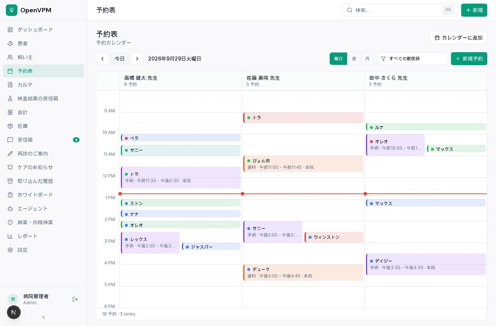
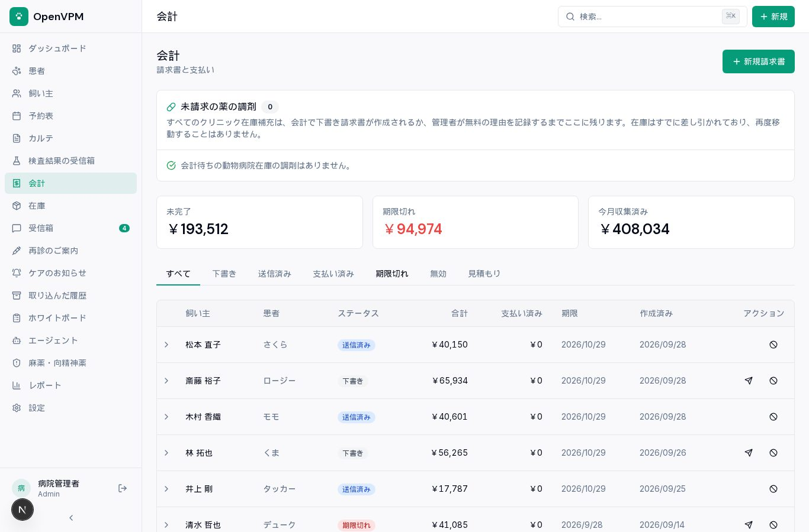
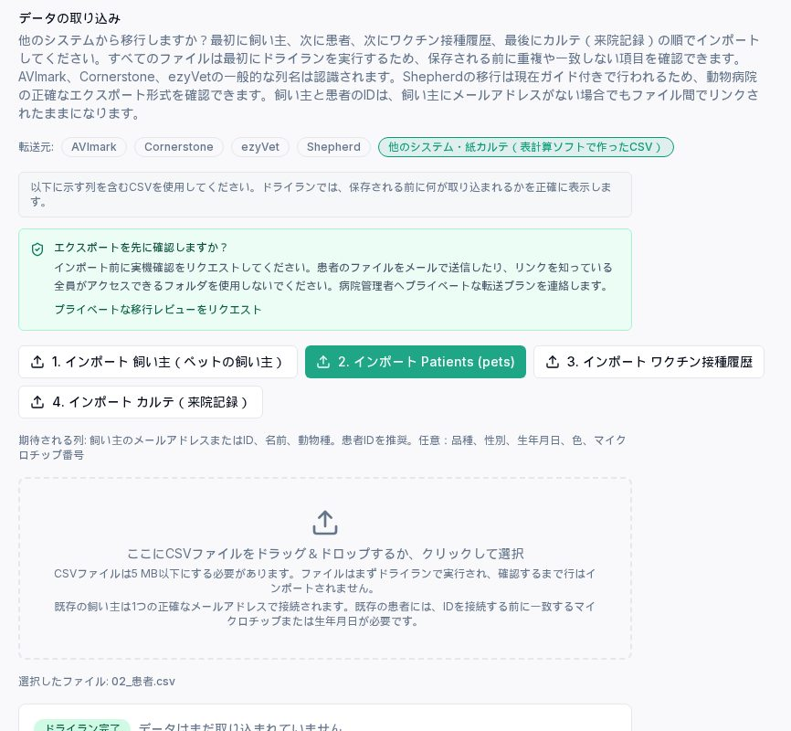

動物病院の電子カルテは、月額の利用料がかかるクラウド型が中心です。「紙カルテのままでは限界だけれど、固定費は増やしたくない」「カルテのデータは自院で持っておきたい」という病院には、選択肢があまりありません。

そこで、オープンソースの動物病院向け管理システム **OpenVPM** を日本語化し、紙カルテからの移行まで含めて、本番と同じ構成で動くことを確かめました。先に結論を書きます。

- OpenVPM は、カルテ（SOAP記録）・ワクチン接種・処方・検査結果・予約表・会計・在庫・飼い主ポータルまでそろった管理システムです（AGPLv3）
- ただし**本家は英語だけで、翻訳の仕組み自体がありません**。画面の文言は約3,800か所、ソースに英語で直書きされていました
- 当社（名古屋のシステム開発会社・エクスブリッジ）は、翻訳の仕組みを足して全体を日本語にし、日本語版を [katsushi2441/openvpm-jp](https://github.com/katsushi2441/openvpm-jp) で公開しました
- 紙カルテは、表計算ソフトに打ち込んだ CSV で移せます。**日本語の列名・和暦の日付・Excel の普通の CSV（Shift_JIS）のまま**読めるようにしました

## なぜ OpenVPM を選んだか

「動物病院 電子カルテ」は月170回ほど検索されていますが、オープンソースで使えるものは多くありません。

長く続いている OpenVPMS（オーストラリア中心）は、公式サイトに「病院で使うには当団体の有料会員であることがライセンスの条件」と書かれていて、自由には使えません。GitHub にある他のものは、学生の課題のようなものか、更新が止まっているものでした。

OpenVPM は2026年3月に始まった新しいプロジェクトで、開発が活発です。Next.js と PostgreSQL で作られていて、APIも公開されています。スターは35と小さいですが、カルテから在庫まで必要なものがそろっていたので、これを土台にしました。

## 翻訳の仕組みが無い——どう日本語を入れたか

本家には、多言語化の方針を書いた文書（docs/I18N.md）だけがありました。「英語を正とし、訳が無ければ英語に戻す」「新しいライブラリはむやみに足さない」「小さく分けて段階的に」という方針です。

これに沿って、次のようにしました。

1. **英語の文言そのものを鍵にする、小さな翻訳関数を足す。** 訳が無い文言は英語のまま出るので、英語の画面は何も変わりません
2. **画面の直書きの文言を、変換スクリプトで一括して翻訳関数に通す。** TypeScript の構文を読んで、画面のテキスト・入力欄の説明・通知・表の見出しなどを拾いました。対象は約150ファイル、約3,800か所です
3. **訳は、ローカルの LLM（gemma4）で下訳し、機械で検査する。** 数字や `{name}` のような差し込みが消えていないか、英語に無い差し込みを勝手に足していないかを検査し、落ちたものは英語のまま残しました
4. **用語は動物病院の言い方にそろえる。** Patient は「患者」、Client は「飼い主」、Records は「カルテ」、Controlled Substances は「麻薬・向精神薬」です

途中で分かったことがいくつかあります。

- 用語表に「Patient=患者（動物のこと）」と注釈を書いたら、訳文にそのまま「患者（動物）」が出てきました。**用語表に括弧書きの注釈を書いてはいけません**
- 本家のテストの多くは「画面のソースに英語の文言がそのまま書かれているか」を確かめる作りで、変換すると74件が落ちました。テストのときだけ翻訳関数を英文に戻して読ませる仕掛けを入れ、本家の元のコードと同じ結果（4,470件中の失敗は、元から落ちる環境由来の2件だけ）に戻しました
- 状態（active・overdue）や動物種（canine）は、データの値がそのまま画面に出ていました。バッジの部品で訳すようにしています

## 日本の病院に合わせて直したこと

- **医院の国に「日本」を追加。** 円・消費税10%・東京時間になり、日付は 2026/09/29、金額は ¥40,150 の形です。これは本家にも改善提案として送っています（[evangauer/openvpm#343](https://github.com/evangauer/openvpm/pull/343)）
- **名前は「姓 名」の順。** 画面の表示と、検索に使う組み立ての両方を直しました
- **日本語のデモデータ。** 架空の「なごみ動物病院」（スタッフ8人・飼い主25人・患者40頭・請求は円）を作りました
- **本家の「米国の医院のみ」という案内は出さない。** 調べると、これは本家が自社のクラウドで行っている導入支援の対象の話で、機能の制限ではありませんでした。自院のサーバーで動かす日本語版には当てはまらないので、表示しないようにしています

## 紙カルテからの移行

本家には、他の電子カルテから CSV で移す仕組みがあります。飼い主 → 患者 → ワクチン歴 → 診療記録の順に取り込み、毎回「試し実行」で件数と問題のある行を見てから確定します。

ただ、そのままでは日本の紙カルテには使えませんでした。

- 列名は英数字しか読まず、「姓」「動物名」のような日本語の列名は空として弾かれる
- 動物種は dog・cat、性別は MN・FS のような英語の書き方だけ
- 日付の 3/5/2019 は米国式の月/日/年として読む。和暦は読めない
- ファイルは UTF-8 としてしか読まないので、Excel の普通の「CSV（コンマ区切り）」（Shift_JIS）は文字化けする

日本語版では、この4つを直しました。列名は「姓・名・電話番号・動物名・動物種・品種・性別・生年月日・接種日・来院日・主訴・所見・診断・治療」などをそのまま読み、「犬・猫・ウサギ」「去勢オス・避妊メス」、日付は「2019/3/5」「2019年3月5日」「令和元年5月1日」「R5.3.5」と全角数字、ファイルは Shift_JIS を自動で判定します。

本番と同じ構成で、Shift_JIS の CSV 4本（飼い主2件・患者3頭・ワクチン歴3件・診療記録2件）を取り込みました。データベースを直接見て、「令和3年2月20日」が 2021-02-20 に、「去勢オス」が male_neutered に、飼い主番号だけの（メールアドレスが無い）飼い主もきちんと入っていることを確かめています。

紙カルテを全部打ち込むのは大変なので、通院中の患者とワクチン歴から始め、過去の記録は来院のたびに足していくのが現実的だと思います。

## 本番の構成で確かめたこと

開発用のサーバーではなく、本番用のビルドで「サーバーの用意 → 病院の登録 → 移行 → バックアップ → 別のデータベースへの復元」まで通しました。

- **本家の構成が使う MinIO は、もう取得できませんでした。** 公式イメージの無償配布が止まっていて、Docker Hub でも quay.io でも拒否されます。S3 互換の SeaweedFS に置き換えています
- ファイル置き場のバケットを作る処理が、作れたのに失敗扱いで終わり、画面が起動しませんでした。最後に一覧でバケットの有無を見る形に直しています
- スタッフの招待リンクを画面に出す設定は、パスワード再設定のリンクまで見えるようになります。本番では使わず、メール送信を設定するのが安全です
- 動いているときのメモリは、画面が約170MB、データベースが約60MB、ファイル置き場が約120MB。小さなサーバーでも動きます
- バックアップ（データベースと添付ファイル）を別のデータベースに戻し、飼い主・患者・ワクチン歴の件数が一致しました

## まだできていないこと

- 飼い主へのメール・SMS・PDF（同意書など）の文面は英語のままです。SMS は米国の携帯会社向けの仕組みで、日本では使えません
- 日本のペット保険の窓口精算には対応していません
- 数字や名前の前後に入る文の一部は、語順が不自然なところがあります

## 導入するなら

日本語版の本体は無料で、ソースコードは GitHub で公開しています。

- 日本語版のソースコード: [katsushi2441/openvpm-jp](https://github.com/katsushi2441/openvpm-jp)
- 向いている病院・向いていない病院の整理と、紙カルテ移行の進め方: [動物病院の電子カルテをオープンソースで（エクスブリッジ）](https://exbridge.jp/solution/doubutsu.html?ref=vwork-openvpm)
- サーバーの用意から移行・バックアップまでの手順書と設定ファイル一式: [動物病院の電子カルテ OpenVPM 日本語版 導入キット（Kurage App Store）](https://kappstore.exbridge.jp/app.php?id=302ada8100bb954f&ref=vwork-openvpm)

本家 OpenVPM とは提携していない、非公式の日本語版です。医療機器ではないので、診断や投薬の判断は獣医師が行ってください。
