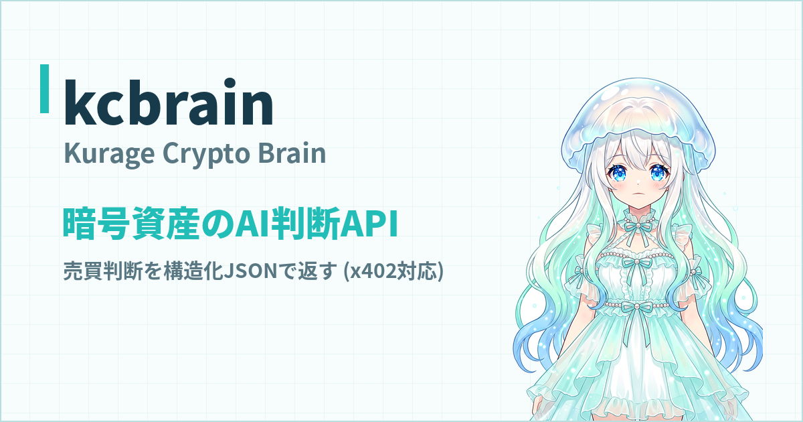
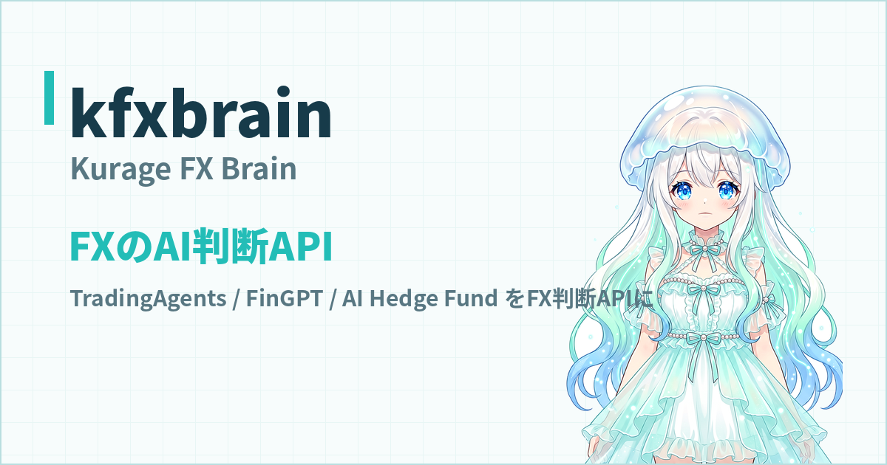
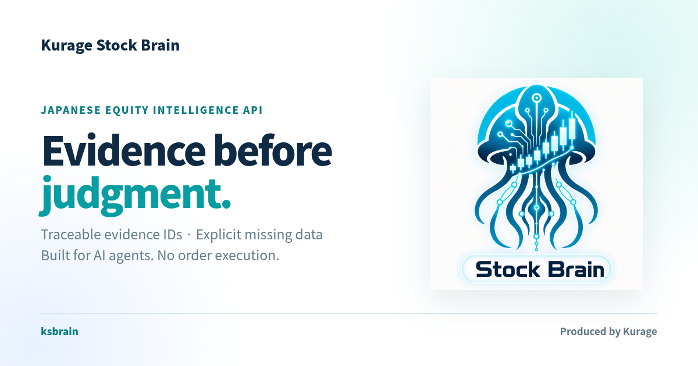

「プログラミングはできない。でもAIで自動売買をやってみたい」——いま、この願いは現実的になりました。

コードはAIに書かせる開発スタイルを**バイブコーディング**と呼びます。同じように、取引戦略のアイデアを日本語でAIに伝え、バックテストで検証しながら戦略を育てる運用スタイルを、私は**バイブトレーディング**と呼んでいます。

やり方はシンプルです。CodexやClaude Codeのようなコーディングエージェントに、こう話しかけるだけです。

> 「東京時間のレンジをブレイクしたら順張りで入る戦略を書いて。損切りはレンジ幅の半分で」
> 「直近3ヶ月でバックテストして。勝率と最大ドローダウンを表にして」
> 「下降トレンドの日はエントリーを止めるフィルターを足して」

戦略の仮説を出すのは人間、コードに落とすのはAI、正しいかどうかを決めるのはバックテストの数字。この分業が回り始めると、戦略づくりは「プログラミングの苦行」ではなく「AIとの対話で仮説を検証していくゲーム」に変わります。本記事では、それを実際にできるツールを紹介します。

## 1. kfreqai — 暗号資産のAI自動取引（Freqtrade/FreqAIベース）

- GitHub: [github.com/katsushi2441/kfreqai](https://github.com/katsushi2441/kfreqai)
- プロダクトサイト: [kfreqai.exbridge.jp](https://kfreqai.exbridge.jp/)
- 稼働中ダッシュボード: [kurage.exbridge.jp/kfreqai.php](https://kurage.exbridge.jp/kfreqai.php)

実績あるOSSの[Freqtrade](https://github.com/freqtrade/freqtrade)とそのFreqAI（LightGBM予測）モジュールの上に、過熱フィルター・ペア別出禁・ボラティリティ連動のポジションサイズ・地合い連動の枠制御といった独自のリスク管理を重ねた、暗号資産の自動取引システムです。

kfreqaiこそ、バイブトレーディングの実例そのものです。戦略のロジックも、リスク管理のルールも、そのほとんどが「AIに日本語で相談して、コードにしてもらい、バックテストで採否を決める」の繰り返しで作られています。ダッシュボードでは複数のAIエージェントが同条件で競い合う様子を公開しており、いま何を保有してどう判断したかを誰でも見られます。

## 2. NOFX 日本語版 — マルチAIトレーダーを走らせる取引OS

- GitHub（日本語版）: [github.com/katsushi2441/nofx](https://github.com/katsushi2441/nofx)
- 本家: [github.com/NoFxAiOS/nofx](https://github.com/NoFxAiOS/nofx)

NOFXは、複数のAIトレーダーをWebダッシュボードから走らせて競わせられるオープンソースの取引OSです。日本語版forkでは、ヘッダーから「日本語」を選ぶだけでUIが日本語化されるのに加え、**日本語戦略モード**を追加しました。AIの思考・判断理由は自然な日本語で表示しつつ、JSONキーや売買アクションなどの機械向け識別子は原文のまま維持するので、翻訳による誤動作を防ぎながら「AIが今なぜそう判断したか」を日本語で追えます。

「AIトレーダーの判断を日本語で読みながら、気になったところをAIに質問して戦略を直す」という体験は、一度やると戻れない面白さがあります。

## 3. OpenAlice-JP — 日本語ファーストのAIトレーディングエージェント

- GitHub（日本語版）: [github.com/katsushi2441/OpenAlice-JP](https://github.com/katsushi2441/OpenAlice-JP)
- 本家サイト: [openalice.ai](https://openalice.ai)

OpenAliceは対話しながら市場分析・取引を進めるAIエージェントのOSSです。OpenAlice-JPはその日本語ファーストforkで、UIロケールは標準で日本語、エージェントの人格も「自然な日本語で答える。ただしティッカーやAPI名・JSONキー・CLIコマンドは翻訳しない」よう調整済み。自己ホスト用のDocker Compose（TLS対応）を同梱し、**取引は読み取り専用モード・自動発注は既定で無効**という安全側の初期設定にしてあります。

まず眺めて、話しかけて、仕組みが分かってから権限を開けていく——非エンジニアの入り口として、この順番で触れるのが日本語版の狙いです。

## 戦略づくりの頭脳を借りる — 判断API 3兄弟

自分でボットを組むほどではないけれど「AIの売買判断」だけ使いたい。そういう用途のために、判断部分だけを切り出したAPIも公開しています。いずれも実際のOSSエージェント（TradingAgents、FinGPT、AI Hedge Fundなど）を固定バージョンで組み込み、判断を構造化JSONで返します。

**kcbrain（Kurage Crypto Brain）** — 暗号資産の判断API。[kcbrain.exbridge.jp](https://kcbrain.exbridge.jp/) ／ [公開テストコンソール](https://kurage.exbridge.jp/kcbrain.php)

**kfxbrain（Kurage FX Brain）** — FXの判断API。[kfxbrain.exbridge.jp](https://kfxbrain.exbridge.jp/) ／ [公開テストコンソール](https://kurage.exbridge.jp/kfxbrain.php)

**ksbrain（Kurage Stock Brain）** — 日本株のインテリジェンスAPI。根拠IDを追跡できる構造化評価を返します。[ksbrain.exbridge.jp](https://ksbrain.exbridge.jp/) ／ 参照アプリ: [TradingAgents-JP（tajp.exbridge.jp）](https://tajp.exbridge.jp/)

自作ボットの判断部分にこれらを組み込めば、「戦略はAIに相談して作り、判断はAIのAPIに聞く」という構成が最初から実現できます。

## 毎日の実践はブログで公開しています

ここで紹介した内容は理屈ではなく、毎日動いているシステムの話です。kfreqaiの検証結果、うまくいかなかった戦略、地合いが変わって崩れた話とその立て直し——実運用の記録はすべて **[Kurageトレードブログ（kurage.exbridge.jp/blog/）](https://kurage.exbridge.jp/blog/)** で公開しています。バイブトレーディングが実際どんな日々なのか、雰囲気を掴むには一番早いはずです。

## 体系的に学ぶなら（書籍）

この一連の実践を、VPS契約とAI環境の導入から、ボット構築、バックテスト、過学習の防ぎ方、運用監視まで全49章に分解した入門書を出版しました。

**[『AIと作る自動取引ボット入門 — バイブコーディング×バイブトレーディングで暗号資産・FX戦略を育てる』（小嶋 篤・Kindle）](https://www.amazon.co.jp/dp/B0HC27BLHG)**

Kindle Unlimitedなら追加料金なしで読み放題です。「画面通りに進めば動く」粒度で書いたので、本記事のツールを触る前後のガイドとしても使えます。

## まとめ

- 戦略のアイデアを日本語で話す → AIがコードにする → バックテストが答えを出す。この繰り返しが**バイブトレーディング**
- まず触るなら: 暗号資産は **kfreqai**、マルチAIトレーダーの観戦と操作は **NOFX日本語版**、対話型エージェントは **OpenAlice-JP**
- 判断だけ借りるなら **kcbrain / kfxbrain / ksbrain**
- 日々の実践は [Kurageトレードブログ](https://kurage.exbridge.jp/blog/)、体系的な入門は[書籍](https://www.amazon.co.jp/dp/B0HC27BLHG)で

※投資は自己責任です。紹介したシステムは検証・ペーパートレードでの運用を基本とし、実資金の投入は仕組みとリスクを理解してから、少額で判断してください。
