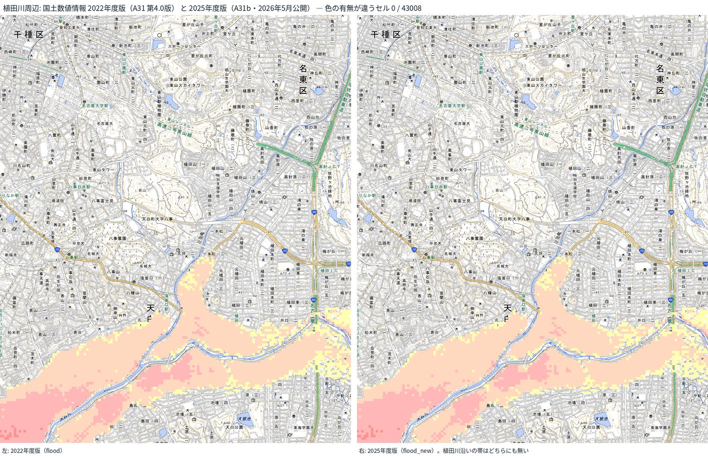

名古屋でAIシステム開発の会社をやっています。9月8日、名古屋は1時間104.5ミリという観測史上1位の雨で、矢田川・植田川・香流川が氾濫し、繁華街は膝下まで冠水、地下街に水が流れ込み、車が水没しました。「あれはハザードマップで予測できたのか」を、当社が前日に公開したばかりの洪水・内水ハザードマップの判定データと、市の避難情報24件の記録で突き合わせました。本編はnoteに、ここでは要点と、システム側で何をしたかを書きます。

- 本編（突き合わせの表と評価）: [note](https://note.com/tokoname/n/n8df98912ad97)
- 判定デモ（住所→何メートル・何日浸かるか、いま学区に出ている発令つき）: [Kurage 洪水・内水ハザードマップ](https://kurage.exbridge.jp/kflood.php/?ref=vwork-nagoya-flood)
- 名古屋市を区・河川から見る: [区・河川ページ](https://kurage.exbridge.jp/kflood.php/nagoya/?ref=vwork-nagoya-flood)

## 1. 何が起きたか

名古屋地方気象台で1時間104.5ミリ。1890年の観測開始以来1位で、2000年の東海豪雨（97ミリ）を超えました。16時30分に記録的短時間大雨情報。市の避難情報は、植田川が警戒レベル3（16時30分）→レベル4（17時00分）→レベル5「緊急安全確保」（17時55分）、香流川がレベル4（16時45分）→レベル5（17時15分）、矢田川がレベル4（17時25分）→レベル5（17時55分）、天白川はレベル4（18時10分）。レベル4以上が16河川と土砂災害で、対象は約101万世帯・198万人でした。

記録的短時間大雨情報と同じ16時30分に植田川のレベル3が出て、85分後の17時55分にはレベル5でした。香流川はレベル4から30分でレベル5です。小さな都市河川は1時間半で最高レベルに達する。「レベル4を見てから逃げる」では間に合わない速さでした。

## 2. 突き合わせの結果（要点）

国土交通省の洪水浸水想定区域（第4.0版・想定最大規模）と名古屋市の内水氾濫ハザードマップ（CC BY）を、住所の代表点で照らしました。

- 東区矢田・北区辻町・中村区名駅（矢田川・庄内川側の低地）: 0.5〜3メートル、浸水継続1〜3日、内水0.3〜1メートル。**地図のとおり**。名駅の値は地下街への流入と整合します。
- 天白区植田南（植田川）: 0.5〜3メートル。地図のとおり。
- 天白区植田1丁目・千種区上野（植田川・矢田川流域でレベル5の対象学区）: 当社の判定では**区域外・内水想定なし**。国の「重ねるハザードマップ」（最新）でもこの2地点の代表点には色が無く、植田1丁目は最寄りの区域まで約60mでした。区域の縁の町で、代表点1点の判定では拾えない例です。
- 中区栄3丁目（繁華街の冠水）: 代表点は区域外だが、中区の面積の28%に内水想定のセルがある。

区の面積で、想定最大規模で0.5メートル以上浸かるおそれがある割合は、西区89%・中村区87%・中川区84%・北区83%・港区52%・南区48%・東区32%。レベル5が出た植田川・香流川の流域は、千種区5%・名東区4%・天白区18%と、民間が使える国のオープンデータでは色が薄い。

## 3. 評価

「どこ」は当たっていました。矢田川・庄内川・新川側の低地は地図の色のとおりに水が来て、車が水没した道路の冠水も内水想定のセルと重なります。

外したのは二つ。一つは時間です。地図は「いつ」を教えません。もう一つはデータの経路です。植田川・香流川・堀川の浸水想定区域図は、愛知県が2025年3月21日に指定し、市の区ごとのハザードマップ（PDF）には反映されています。ところが民間が住所判定に使える全国のGISデータ「国土数値情報（洪水浸水想定区域）」は毎年5月に更新されているのに、最新の2025年度版（2026年5月公開）にもこの指定分が入っておらず（愛知県分の更新年月は2024年6月1日）、県・市の公開はPDFだけです。国の「重ねるハザードマップ」（画像タイル）には都道府県の新しい指定が随時反映されていて（直近の更新は2026年8月6日）、植田川沿いと堀川沿いを100m格子で突き合わせると、ポータルには色があるのに国土数値情報には無い点が、植田川周辺で2,500点中138点、堀川周辺で1,891点中163点ありました（香流川周辺はほぼ一致。2022年度版・2025年度版のどちらで突き合わせても同じ数です）。その138点を学区に落とすと、天白区の大坪・植田・植田北・八事東、名東区の牧の原・西山・前山、千種区の田代・見付に集中していて、8日に植田川のレベル5の対象になった学区とそのまま重なります。堀川の163点は昭和区の白金・村雲、中区の平和・橘、熱田区の高蔵で、こちらも堀川・新堀川の発令対象の学区です。つまり国は図面を持っているのに、属性付きのGISデータ（国土数値情報）には県の指定から1年以上経っても入っていない。だから当社を含む民間の住所判定では、その分が「区域外」と出てしまう。市のPDFと国のポータルには色があるのに、住所を入れて調べる道具には届いていない。

## 4. システム側で、翌日までにやったこと

- **「区域外」を「安全」と読ませない**: 判定に使ったデータの年度と、未収録の河川がある旨を毎回添える設計は、この日のためでした。区ページには「0%でも浸水しないという意味ではない」と明記しています。
- **いまの発令を判定に添える**: 名古屋市の学区線（CC BY・268学区）を取り込み、市の災害情報配信から警戒レベル・河川・対象学区の事実だけを抽出して、住所の判定・マイ・タイムライン・CSV一括に載せました。取得できないときは「取得できない」と言い、「発令なし」とは言いません。
- **河川ごと・区ごとのページ**: 当日の発令24件をそのまま記録し、天白川・矢田川など17河川と16区のページにしました。次の大雨のときに「いま何が出ているか」「対象学区はどこか」「前回はいつ何が出たか」が並びます。
- **区の浸水のおそれ**: 学区線に800点を打つサンプリング推定で、区ごとの「0.5メートル以上」「3メートル以上」「家屋倒壊区域」「内水」の割合を出しました（誤差±3ポイント）。

## 5. 当日、Xで起きたこと

市議の投稿が洪水一色になった夕方、投稿にこのシステムのURLを付けて返信したところ、50分で120人が来ました。デモ（住所を入れて判定する画面）が80人、商品ページが42人。人が欲しかったのは「買う」ではなく「うちは何メートル浸かるか」でした。災害の当日は、判定できるページを直接貼るのが正しい、という学びです。

## 6. 事務所・自治体・会社で同じものを持つ

- 買い切り版（ソースコードMIT・取り込みスクリプト・設置手順書・AI設置指示書つき、55,000円 税込）: [Kurage App Store](https://kappstore.exbridge.jp/app.php?id=41a09acc163dcb7d&ref=vwork-nagoya-flood)
- 画面や項目を変えたい、他の自治体のデータを組み込みたい: [バイブOSSカスタマイズ](https://kurage.exbridge.jp/vibe-oss.html?ref=vwork-nagoya-flood)
- 名古屋市内の事務所・企業（政党・議員事務所も同条件）: [AI-IT顧問契約](https://exbridge.jp/ai-it-komon.html?ref=vwork-nagoya-flood)（キャンペーン期間中はKurage App Storeの商品代金が無料）

## 7. 正直に

代表点1点で照らす判定は、内水のセルを取りこぼします。住所の周辺100〜200メートルの最大値も添える改良を次にやります。県が指定済みでもGISデータが配布されていない小河川（植田川・香流川・堀川）は、県・市がデータを公開するか、PDFから起こすまで地図の色が薄いままです。市の内水氾濫ハザードマップはCC BYのGISデータで公開されていて、当社の判定はそれで動いています。洪水も同じ形で公開してほしい、というのが市と議会への次の話です。それまでは「薄い」と見せ続けるのが、この道具の役目だと思っています。

## 訂正（9月9日）

初出で植田川のレベル5を16時30分と書いていましたが、市の災害情報配信の記録では16時30分はレベル3で、レベル5は17時55分でした（香流川はレベル4が16時45分、レベル5が17時15分。矢田川はレベル4が17時25分、レベル5が17時55分）。あわせて「小さな都市河川は国の洪水想定に一部しか載っていない」を、「県は2025年3月に指定済みだが、GISデータとして民間に配布されていない」に改めました。同日追記: 植田1丁目の「区域外」を国データの穴の例として書いていましたが、最新の国のポータルでもこの代表点は区域外（区域まで約60m）でした。穴の実測は上記の格子比較（植田川周辺138点・堀川周辺163点）に置き換えます。

同日追記2（9月9日夜）: 「国土数値情報は2022年度版で止まっている」は誤りでした。最新版（2025年度版）で同じ突き合わせをやり直した結果と、なぜ違うのかを、末尾の「追記」にまとめています。本文はその事実に合わせて書き直しました。

## 追記（9月9日夜）国土数値情報の最新版（2025年度版）でも、結果は同じでした

本文の初出では「民間が使える国土数値情報は2022年度版で止まっている」と書いていました。これは私の誤りです。国土数値情報の洪水浸水想定区域は識別子が A31 から A31b に変わり、2023年度版から毎年5月に更新されています。最新は2025年度版（2026年5月公開）です。旧識別子のページに「最新は第4.0版（2022年度）」と書かれたまま残っていて、私はそのページだけを見ていました。

そこで、2025年度版の名古屋周辺（1次メッシュ 5236・5237）を取り込み、本文と同じ100m格子の突き合わせをやり直しました。国の「重ねるハザードマップ」には色があるのに、国土数値情報には無い点の数です。

| 範囲 | 格子点 | 2022年度版で「ポータルだけ」 | 2025年度版で「ポータルだけ」 |
|---|---|---|---|
| 植田川周辺（天白区植田〜名東区） | 2,500 | 138 | 138 |
| 香流川周辺（千種区〜名東区〜守山区） | 1,891 | 5 | 5 |
| 堀川周辺（中区・北区） | 1,891 | 163 | 163 |

一点も減っていません。植田川周辺を約40mの格子（43,008セル）で見ても、2022年度版と2025年度版は色の有無・深さ区分ともに差が0セルでした。市の図と国のポータルにある植田川沿いの帯は、最新の国土数値情報にもありません。

なぜ最新版にも入っていないのか。2025年度版に付いている河川一覧を見ると、愛知県の85行は「更新年月」がすべて2024年6月1日です。同じ一覧で、北海道は1,060行が2025年10月、長崎県は全行が2025年10月、新潟県は123行が2026年6月と、他の県の2025年3月より後の提供分は入っています。つまり国の締切が早かったのではなく、愛知県が2025年3月21日に指定した分だけが、国土数値情報の収集に載っていません。2023年度版・2024年度版の一覧でも愛知県は2024年6月のままです。

一方、国の重ねるハザードマップ（画像タイル）は2025年3月・8月・10月・12月、2026年2月に都道府県管理河川・その他河川を数百〜2,558河川ずつ追加していて、県からポータルへの経路は動いています。名古屋市は県の図面を直接受け取って2026年4月のハザードマップに載せました。県の図面が国へ届く経路は2本あり、画像の経路は届いていて、民間が属性付きで使えるベクターの経路だけ止まっている、というのが実態です。県が国土数値情報向けに提供しなかったのか、国が収集しなかったのかは、公開資料からは分かりません。

2021年の水防法改正は、植田川のような中小河川が指定された理由です。締切の令和6年度末に全国で一括指定が起きました。ただ、法律は県の図面を国土数値情報に何か月以内に載せよとは定めていないので、改正が「入らない理由」ではありません。

言い直すと、問題は「国の更新が止まっている」ではなく、「毎年更新の仕組みはあるのに、県の指定分が片方の経路だけ落ちていて、次に入るとしても2026年度版（2027年5月）」です。市と議会、国へのお願いの中身は変わりません。都道府県の指定と同時に、ハザードマップポータルと国土数値情報の両方へ届く運用にしてほしい、ということです。

参照: 国土数値情報 洪水浸水想定区域（1次メッシュ単位）A31b 2025年度版 https://nlftp.mlit.go.jp/ksj/gml/datalist/KsjTmplt-A31b-2025.html ／ ハザードマップポータルサイト 更新情報 https://disaportal.gsi.go.jp/hazardmapportal/hazardmap/update/update.html
