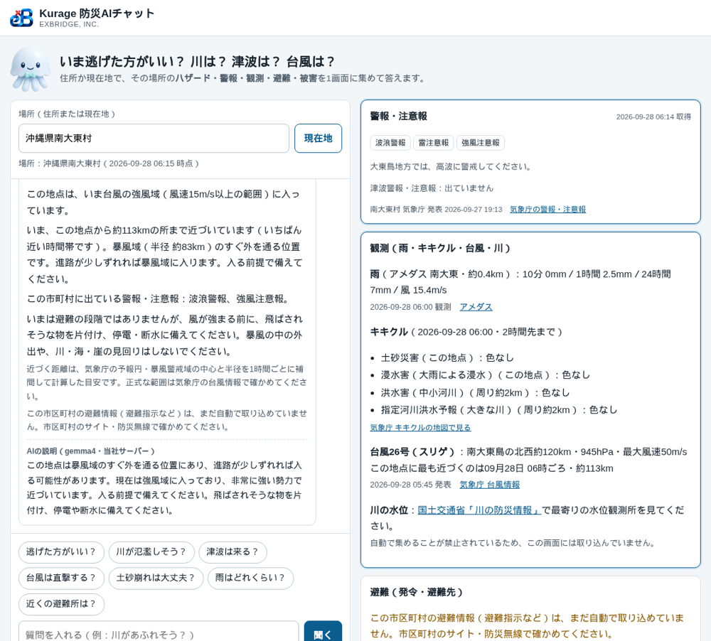

住所か現在地を入れて「逃げた方がいい？」と聞くと、その場所に関係する防災の情報を1画面に集めて、いまやることまで答えるチャットを作りました。

- デモ: [Kurage 防災AIチャット](https://kurage.exbridge.jp/kbousai.php/?ref=vibeblog_kbousai)

「逃げた方がいい？」は一例で、「川が氾濫しそう？」「津波は来る？」「台風は直撃する？」「土砂崩れは大丈夫？」「近くの避難所は？」のように、聞きたいことをそのまま聞けます。

## きっかけは長崎県の防災ポータル

長崎県の防災ポータルを見ていて、防災の情報は **警報・観測・避難・被害** の4つがそろって初めて役に立つ、と思いました。これにハザードマップを足した5つです。

ただ、県のポータルは県全体の話です。住民が知りたいのは「うちはどうなのか」です。当社にはすでに、住所から洪水・土砂災害・津波の想定や避難所までの徒歩時間を出すシステムが4つあります（kflood・khazard・ktsunami・krefuge）。これに気象庁の観測を足して、住所1つで5つがそろう画面を作ることにしました。

## 質問ごとに、見る情報を変えた

同じ場所でも、質問によって見るべき情報が違います。

- **川が氾濫しそう？** 周り約2kmの洪水キキクル（中小河川と、指定河川洪水予報の大きな川）、最寄りのアメダスの雨量、その場所の浸水の想定
- **津波は来る？** その県の沿岸の津波警報・注意報、その場所の浸水の想定と標高、近い避難先
- **台風は直撃する？** 台風の位置と強さ、その場所に最も近づく時刻と距離、暴風警戒域・予報円・強風域に入るか
- **土砂崩れは大丈夫？** その地点の土砂キキクルと、土砂災害警戒区域に入っているか

答えの横には、ハザード・警報・観測・避難・被害の5枚のカードを並べ、それぞれに時点と出典を付けています。

## 逃げるかどうかは、AIに決めさせない

いちばん迷ったのはここです。AIに全部の情報を渡して「逃げるべきか答えて」とやれば、それらしい文は出ます。でも、同じ状況で答えが揺れるかもしれない。命に関わる判断を、そういうものに任せたくありませんでした。

そこで、結論は決まった規則で出すことにしました。内閣府「避難情報に関するガイドライン」の警戒レベルに合わせて、次の4つを同じ物差しに載せます。

- 市区町村の避難情報（警戒レベル3〜5）
- 気象庁の警報（大雨・洪水・土砂・高潮と特別警報）
- キキクル（黄＝レベル2、赤＝3、紫＝4、黒＝5相当）
- 津波警報・注意報

そのうえで、その場所が家屋倒壊等氾濫想定区域・土砂災害警戒区域・津波浸水想定区域にあたるかを組み合わせて、「全員避難」「高齢の方から避難」「準備」を言い分けます。

AI（当社サーバーで動かしている gemma4）は、その結論を質問に合わせて3〜4文に言い換えるだけです。渡すのはその回に集めた事実だけにしています。AIが遅いときや止まっているときでも、規則の答えとカードはすぐに出ます。災害の日にアクセスが集中しても、事実が見えなくなることはありません。

作ってすぐ、名古屋市で試したら「避難の準備をしておく段階です」と出ました。原因は **雷注意報** でした。注意報をすべてレベル2として数えていたのです。雷・強風・波浪の注意報は表示はしますが、避難の段階には数えないように直しました。こういう分岐は、自動テストで固定しています。

## 実際の台風26号で試して、不具合を見つけた

公開した日に、ちょうど台風26号（スリゲ、中心気圧945hPa）が南大東島の近くにいました。「台風は直撃する？」を南大東村で聞くと、こう答えます。

距離は、気象庁の台風情報の予報円と暴風警戒域の中心・半径を1時間ごとに補間して計算しています。

実は、この画面の前に不具合がありました。朝6時に撮り直したら、台風が約113kmまで近づいているのに「暴風警戒域には入らない予報です」「いま、避難が必要な情報は出ていません」とだけ出ていたのです。

理由は2つありました。いちばん近づく時刻が「いま」だったので、比べる半径が予報の暴風警戒域ではなく、いまの暴風域（約83km）になっていたこと。そして、境目の余裕を半径の3割で取っていたので、113kmがぎりぎり外に出たことです。実際には島は強風域に入っていて、アメダスでは風速15m/sを超えていました。

直したのは3つです。

- いま強風域に入っているかを出す
- 最も近づくのが「いま」なら、「いま、約113kmまで近づいています」と言う
- 境目は割合でなく、少なくとも50kmの幅で見て、その内側なら「入らない」と言い切らず、入る前提で備えるよう伝える

## 川の水位は、取り込まなかった

「河川の水位」は入れたかった情報です。国土交通省の「川の防災情報」を見ると、利用規約に「ツール等による定期的なデータ収集は…お控えください」と書かれていました。データを機械で使うには、河川情報センターの有償の配信サービスに申し込む必要があります。

なので水位は取り込まず、代わりに気象庁のキキクルの「洪水」と「指定河川洪水予報」を地点の周り約2kmで読み、水位そのものは川の防災情報へのリンクで案内しています。

キキクルは画像のタイルで配られています。地点の画素の色を読み、気象庁の凡例の色（黄・赤・紫・黒）と照らして段階にしています。

## 取れないものは「取れない」と書く

避難指示などの発令を自動で取れるのは、いまは名古屋市・東京都・千葉県・神奈川県・静岡県だけです。ほかの地域では「発令なし」とは書かず、「取り込めていません。市区町村のサイト・防災無線で確かめてください」と出します。

被害（けが人・住宅・通行止め）は、全国をまとめて機械で読めるデータが公開されていません。これも正直にそう書いて、消防庁と自治体の発表へ案内しています。

## 自治体・事務所のサーバーに置けるようにした

チャットは4つのエンジンから情報を集めて動くので、エンジンと一緒の一式にして Kurage App Store に出しました。名前・ロゴ・運営者名は設定ファイルで変えられ、計測タグは書かなければ出ません。

[Kurage 防災AIチャット＋防災判定セット（Kurage App Store）](https://kappstore.exbridge.jp/app.php?id=cf817fdce13ee120&ref=vibeblog_kbousai)

出品の準備で配布物を見直したら、エンジン側に当社のアクセス計測のタグと、検索エンジン向けの正式URL（canonical）が当社のドメインのまま残っていました。買った会社が公開すると、アクセスが当社に記録され、検索エンジンからは当社のページの写しに見えます。配布物からは計測タグを抜き、公開するドメインを1行書けば正式URLがそのドメインに置き換わるようにしました。

## 振り返り

防災の画面で怖いのは、間違った安心を出すことです。「発令なし」と「取れていない」を混ぜない、境目で「入らない」と言い切らない、逃げるかどうかをAIの気分に任せない。作りながら、この3つを何度も確かめることになりました。台風の不具合は、実際の台風で試さなければ気づかなかったと思います。

ほかにも、触ってから決められるデモを置いています。

[デモ一覧｜触ってから決める業務システム](https://proto.exbridge.jp/?ref=vibeblog_kbousai)
