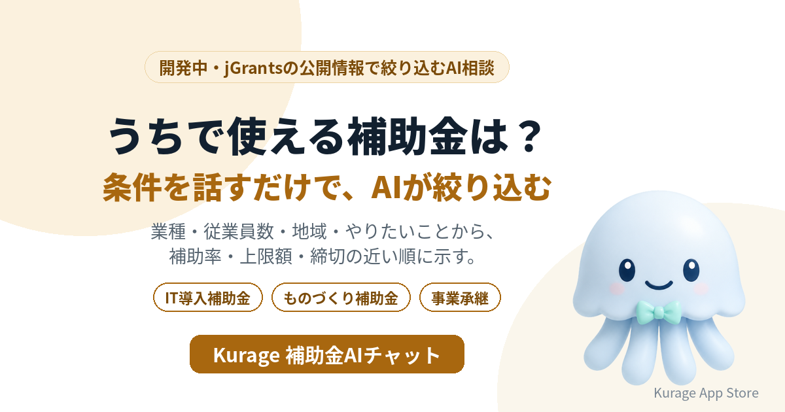

補助金は数が多く、対象や締切も細かく分かれています。業種・従業員数・地域・やりたいことを話すと、いま申請できる補助金を絞り込んで答えるAI相談システムを開発しています。名前は **Kurage 補助金AIチャット** です。

- 詳しい説明: [Kurage 補助金AIチャット（開発中）](https://exbridge.jp/solution/khojokin-ai.html?ref=vibeblog_khojokin-ai)
- Kurage App Store の掲載: [Kurage 補助金AIチャット](https://kappstore.exbridge.jp/app.php?id=7af2a50b580f8992&ref=vibeblog_khojokin-ai)

まだシステムはありません。先に入口のページだけを公開し、使いたい方からの問い合わせやアクセスを見てから作ります。

## 補助金の名前で検索している人が多い

キーワードプランナーで測ると（2026年10月1日）、こういう語が検索されています。

- IT導入補助金: 27,100
- ものづくり補助金: 27,100
- 事業承継補助金: 3,600
- 補助金 中小企業: 3,600

補助金の名前は知っていても、自分の会社が対象になるのか、いま公募しているのか、締切はいつかは、公募要領を読まないと分かりません。

## 会社の条件を話すだけで

予定している答え方は次のとおりです。

- **社員10人の製造業。設備を入れたいが、使える補助金は？** — 業種・従業員数・地域・目的が合う補助金を絞り込み、補助率・上限額・締切の近い順に示します。
- **会計ソフトを入れたい。IT導入補助金は使える？** — 対象・補助率・申請の流れと、いま公募中かどうかを示します。
- **締切が近いものだけ知りたい** — 条件に合う補助金を締切の近い順に並べ、申請に要る準備の目安を添えます。
- **事業を引き継ぐ予定** — 事業承継・引継ぎに使える補助金を示します。

## 採択されるかは判定しない

絞り込みは、補助金の公開情報（対象・補助率・上限額・締切）を規則で当てはめて行います。AIはその結果を言い換えるだけなので、存在しない補助金や金額を作りません。採択されるかどうかは審査で決まるので、判定しません。

jGrantsにはすべての補助金・助成金が載っているわけではありません。対応している範囲は、画面に明記します。

## いまの補助金ナビとの違い

当社にはすでに [Kurage 補助金ナビ](https://kurage.exbridge.jp/khojokin.php/?ref=vibeblog_khojokin-ai) があります。条件を選んで絞り込む画面で、デジタル庁のjGrantsの公開情報を使っています。補助金AIチャットは、会社の状況を言葉で話すと、それを条件に直して絞り込み、結果を説明する形にします。申請書の様式を埋める [申請書記入アシスト](https://kappstore.exbridge.jp/app.php?id=6ae90e27bf778a42&ref=vibeblog_khojokin-ai) と組み合わせることも考えています。

## 作る前に、入口だけを出した理由

中小企業が自分で使うのか、士業や商工会議所が相談の一次対応に使うのか、IT・設備の販売会社がお客様への提案に使うのかで、必要な画面と補助金の範囲が変わります。使いたい方の声を聞いてから、開発の順番と仕様を決めます。

## 使ってみたい方へ

士業・支援機関のサイトへの設置や、AIエージェントから呼べるMCPサーバーの形を考えています。お気軽にお問い合わせください。

- [Kurage 補助金AIチャット（開発中）の説明と問い合わせ](https://exbridge.jp/solution/khojokin-ai.html?ref=vibeblog_khojokin-ai)
