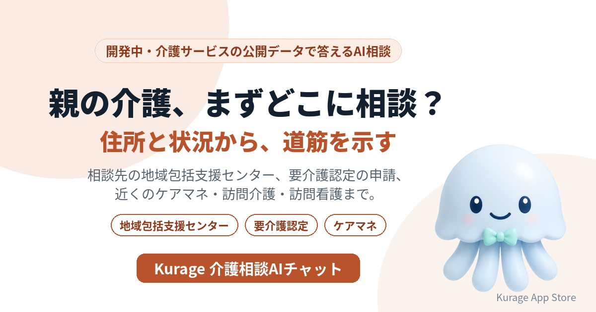

親の介護が必要になったとき、最初に迷うのは「どこに相談すればいいか」です。住所と状況から道筋を示すAI相談システムを開発しています。名前は **Kurage 介護相談AIチャット** です。

- 詳しい説明: [Kurage 介護相談AIチャット（開発中）](https://exbridge.jp/solution/kkaigo-soudan.html?ref=vibeblog_kkaigo-soudan)
- Kurage App Store の掲載: [Kurage 介護相談AIチャット](https://kappstore.exbridge.jp/app.php?id=9a5b83640c786d9b&ref=vibeblog_kkaigo-soudan)

まだシステムはありません。先に入口のページだけを公開し、使いたい方からの問い合わせやアクセスを見てから作ります。

## 「地域包括支援センター」は月74,000回検索されている

キーワードプランナーで測ると（2026年10月1日）、介護の相談まわりでいちばん多いのはこの語でした。

- 地域包括支援センター: 74,000
- 包括支援センター: 27,100
- 介護の相談: 1,900

地域包括支援センターは、高齢者の介護・医療・福祉の相談をまとめて受ける窓口で、介護保険法にもとづいて市区町村が設けます。住んでいる地域ごとに担当のセンターが決まっています。ただ、介護が始まったばかりの家族には、その名前も、自分の担当がどこかも分からないことが多いと思います。

当社のサイトでも、介護事業所ナビ・障害者グループホームナビの事業所ページに、法人名や事業所名で検索して来る人が毎日来ています。介護で何かを探している人は確かにいます。

## 住所と状況から、道筋を示す

予定している答え方は次のとおりです。

- **まずどこに相談すればいい？** — 住所から相談先の地域包括支援センターを示し、相談の前に整理しておくこと（本人の様子、困っていること、介護保険の被保険者証）を案内します。
- **要介護認定の申請はどうする？** — 申請先と、申請から認定までの流れ（訪問調査・主治医の意見書・審査・判定・通知）を、介護保険法の規定に沿って示します。
- **近くでケアマネを探したい** — 厚生労働省の介護サービス情報公表システムのオープンデータから、近い居宅介護支援事業所を距離の順に示します。
- **訪問介護や訪問看護も使える？** — 状況に合うサービスの種類と、近くの事業所を示します。

## 空き状況は「分からない」と答える

空き状況や料金は、どの公開データにも含まれていません。ここをAIにそれらしく答えさせると、家族が電話をかけてから困ります。なので、公開データに無いことは「公開データには無いので、電話で確かめてください」と答え、確かめるべき点を添えます。

事業所・相談先・手続きの順番は、公開データと規則で決めます。AIはその結果を言い換えるだけなので、存在しない事業所や制度を作りません。

## 土台はもうある

- [Kurage 介護事業所ナビ](https://kurage.exbridge.jp/kkaigo.php/?ref=vibeblog_kkaigo-soudan) — 訪問介護・ケアマネ事業所ほかを名前・住所から（厚生労働省の介護サービス情報公表システムのオープンデータ）
- [Kurage 訪問看護ナビ](https://kurage.exbridge.jp/khokan.php/?ref=vibeblog_kkaigo-soudan) — 訪問看護ステーションを名前・住所から。24時間対応などの届出も（地方厚生局の名簿）
- [障害者グループホームナビ](https://kurage.exbridge.jp/kghome.php/?ref=vibeblog_kkaigo-soudan) — 障害福祉サービスの事業所（WAM NET）
- [Kurage 制度ナビ](https://kurage.exbridge.jp/kseido.php/?ref=vibeblog_kkaigo-soudan) — 困りごとから使える制度と申請先

地域包括支援センターの一覧は、市区町村の公表を取り込む予定です。データの形と利用条件は、地域ごとに確かめてから使います。

## 作る前に、入口だけを出した理由

地域包括支援センターの窓口で一次対応に使うのか、病院の退院支援で紹介先を探すのに使うのか、議員事務所が住民の相談を受けるのに使うのかで、必要な画面が変わります。使いたい方の声を聞いてから、開発の順番と仕様を決めます。

## 使ってみたい方へ

対象の地域と必要な項目を伺って仕様を決めます。お気軽にお問い合わせください。

- [Kurage 介護相談AIチャット（開発中）の説明と問い合わせ](https://exbridge.jp/solution/kkaigo-soudan.html?ref=vibeblog_kkaigo-soudan)
