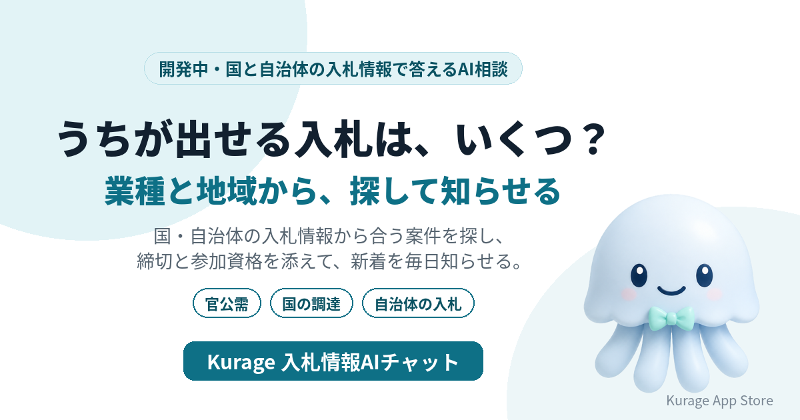

国や自治体の入札情報は、発注機関ごとに別々のサイトに出ています。自社の業種・地域・得意な仕事を伝えると、合う案件を探して締切と参加資格を添えて答え、新しい案件を毎日知らせるAI相談システムを開発しています。名前は **Kurage 入札情報AIチャット** です。

- 詳しい説明: [Kurage 入札情報AIチャット（開発中）](https://exbridge.jp/solution/knyusatsu.html?ref=vibeblog_knyusatsu)
- Kurage App Store の掲載: [Kurage 入札情報AIチャット](https://kappstore.exbridge.jp/app.php?id=464a65ef3e6a3646&ref=vibeblog_knyusatsu)

まだシステムはありません。先に入口のページだけを公開し、使いたい方からの問い合わせやアクセスを見てから作ります。

## 入札情報を探している人は多い

キーワードプランナーで測ると（2026年10月1日）、こういう語が検索されています。

- 入札: 9,900
- 入札情報: 2,900
- 国交省 入札: 2,900

官公庁と取引する会社にとって、入札情報を見落とすことは、その案件を取れないことと同じです。でも、国の機関、県、市町村とサイトが分かれていて、毎日見て回るのは大変です。

## 業種と地域から探して、毎日知らせる

予定している答え方は次のとおりです。

- **愛知県内で、うちが出せそうな測量の入札は？** — 入札情報の公開データから、地域と業種が合う案件を探し、締切・発注機関・参加資格の条件とともに示します。
- **今週締切の案件だけ知りたい** — 条件に合う案件を締切の近い順に並べます。
- **新しい案件が出たら知らせてほしい** — 条件を登録しておくと、新しく公開された案件を毎日まとめて知らせます。
- **参加資格は足りている？** — 案件に書かれた参加資格（等級・業種区分・地域要件など）を示し、自社の資格と照らし合わせて確かめるべき点を整理します。参加できるかの最終判断は、発注機関の公告によります。

## 案件を作らない

絞り込みは、取り込んだ入札情報を業種・地域・締切の条件で規則に従って行います。AIはその結果を言い換えて説明するだけなので、存在しない案件や条件を作りません。案件の詳細と最新の状態は、必ず発注機関の公告で確かめるよう案内します。落札できるかどうかも判定しません。

## 使う公開データと土台

- 中小企業庁の官公需情報ポータルサイト（国・自治体などの入札情報。検索APIの利用条件は取り込む前に確かめます）
- 国の調達ポータル
- 導入する地域の自治体の入札情報

毎日の見回りには、他社サイトや官公庁の新着を監視する当社の [kcheckit](https://kappstore.exbridge.jp/app.php?id=232b3c1d11b6a730&ref=vibeblog_knyusatsu) の仕組みを土台にします。

## 作る前に、入口だけを出した理由

建設・測量・IT・印刷・清掃など、業種によって見るべき発注機関も言葉も違います。どの業種・地域の会社が使いたいかを聞いてから、取り込む範囲を決めます。

## 使ってみたい方へ

メールやチャットへの通知、社内システムへの連携を考えています。業種区分・地域・案件の言葉の条件を、導入する会社に合わせて設定します。お気軽にお問い合わせください。

- [Kurage 入札情報AIチャット（開発中）の説明と問い合わせ](https://exbridge.jp/solution/knyusatsu.html?ref=vibeblog_knyusatsu)
