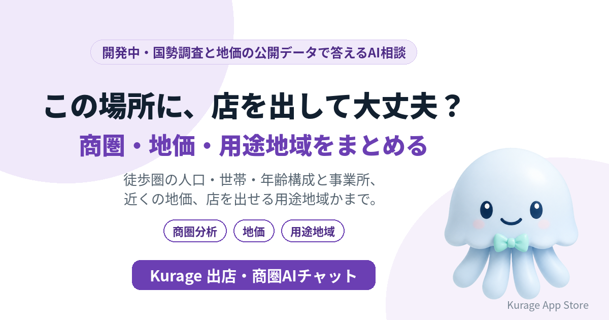

出店の候補地が見つかったとき、徒歩圏にどんな人が住み、どんな事業所があり、地価はどのくらいで、そもそも店を出せる用途地域か——確かめることはたくさんあります。候補地の住所を入れると、これらを国の公開データから集めて答えるAI相談システムを開発しています。名前は **Kurage 出店・商圏AIチャット** です。

- 詳しい説明: [Kurage 出店・商圏AIチャット（開発中）](https://exbridge.jp/solution/kshoken-ai.html?ref=vibeblog_kshoken-ai)
- Kurage App Store の掲載: [Kurage 出店・商圏AIチャット](https://kappstore.exbridge.jp/app.php?id=9d2ee25623cc71c5&ref=vibeblog_kshoken-ai)

まだシステムはありません。先に入口のページだけを公開し、使いたい方からの問い合わせやアクセスを見てから作ります。

## 検索は少ないが、材料はそろっている

正直に書くと、この分野の検索はそれほど多くありません（キーワードプランナー、2026年10月1日）。

- 商圏分析: 210
- 地価 調べる: 110
- 出店 場所: 50

それでも作る価値があると考えたのは、材料がすでにそろっているからです。当社には、住所から徒歩圏の人口・世帯・事業所を出す [商圏分析](https://kurage.exbridge.jp/kshoken.php/?ref=vibeblog_kshoken-ai) と、用途地域・建ぺい率・容積率を引く [都市計画ナビ](https://kurage.exbridge.jp/ktoshikeikaku.php/?ref=vibeblog_kshoken-ai) があります。これに地価を足し、質問に答える形にすれば、店舗開発の担当者が候補地ごとにいくつものサイトで調べている下調べを、1回の質問にまとめられます。

## 候補地の住所から、まとめて

予定している答え方は次のとおりです。

- **徒歩10分圏に、どんな人が住んでいる？** — 国勢調査の小地域データから、人口・世帯数・年齢構成を示します。
- **近くに同じ業種の店や事業所はどのくらいある？** — 経済センサスから、徒歩圏の事業所数を業種別に示します。
- **地価はどのくらい？** — 近くの地価公示・地価調査の地点の価格を示します。
- **そもそもこの場所に店を出せる？** — 用途地域から、店舗を建てられる区域か、床面積などの制限があるかを示します。最終判断は自治体の窓口や専門家に確かめるよう案内します。

## 売上は予測しない

売上は、立地のほかに商品・価格・人・競合の動きで大きく変わります。公開データだけで予測すると、もっともらしい数字が一人歩きします。なので、このシステムは売上を予測せず、「出店すべきか」も判断しません。人口・事業所・地価・用途地域は公開データの値をそのまま示し、AIはそれを説明するだけです。データの時点（国勢調査は5年ごと、地価公示は毎年など）も画面に明記します。

## 作る前に、入口だけを出した理由

飲食・美容・小売の店舗開発で使うのか、フランチャイズ本部が加盟希望者への説明に使うのか、不動産会社が店舗物件の説明に使うのかで、見せ方が変わります。使いたい方の声を聞いてから、開発の順番と仕様を決めます。

## 使ってみたい方へ

店舗開発の社内ツール、フランチャイズ本部のサイト、不動産会社の物件ページへの設置を考えています。お気軽にお問い合わせください。

- [Kurage 出店・商圏AIチャット（開発中）の説明と問い合わせ](https://exbridge.jp/solution/kshoken-ai.html?ref=vibeblog_kshoken-ai)
