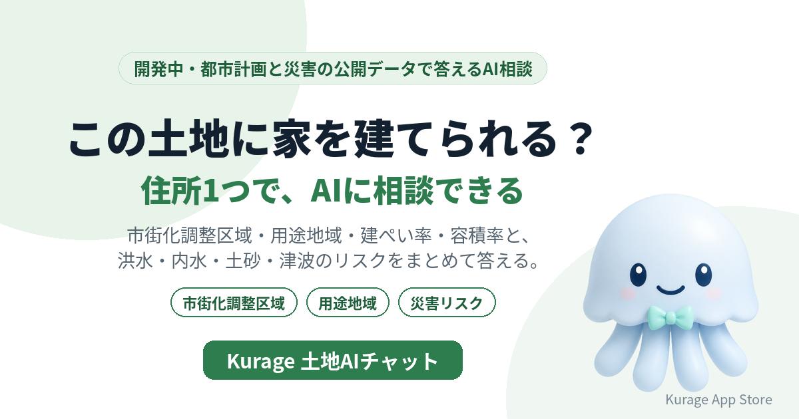

「この土地に家を建てられる？」に、住所1つで答えるAI相談システムを開発しています。名前は **Kurage 土地AIチャット** です。

- 詳しい説明: [Kurage 土地AIチャット（開発中）](https://exbridge.jp/solution/ktochi.html?ref=vibeblog_ktochi)
- Kurage App Store の掲載: [Kurage 土地AIチャット](https://kappstore.exbridge.jp/app.php?id=3caa6a1697f5f568&ref=vibeblog_ktochi)

まだシステムはありません。先に入口のページだけを公開し、使いたい方からの問い合わせやアクセスを見てから作ります。この記事では、なぜこれを作るのか、どう答えるのかを書きます。

## 「市街化調整区域」は月18,100回検索されている

Google のキーワードプランナーで、土地まわりの語の月間検索数を測りました（2026年10月1日）。

- 市街化調整区域: 18,100
- 市街化調整区域とは: 14,800
- 市街化調整区域に家を建てる: 880
- 用途地域の調べ方: 720

「市街化調整区域とは」を調べる人の多くは、気になる土地がまさにそれだった人だと思います。ところが、その土地が市街化調整区域かどうかは、自治体の都市計画図を開いて地図をたどらないと分かりません。分かっても、次に「では家は建つのか」「水害は大丈夫か」と、調べることが続きます。

## 住所1つで、まとめて答える

予定している答え方は次のとおりです。

- **この住所は市街化調整区域？家は建てられる？** — 国土交通省の都市計画決定GISデータから区域区分と用途地域を引き、市街化調整区域なら「原則として建築が制限される区域」であることを、都市計画法の条文とともに示します。建てられるかの最終判断は自治体の開発許可の窓口なので、窓口で確かめるべき点を整理します。
- **建ぺい率と容積率は？** — その地点の用途地域の建ぺい率・容積率を示し、敷地面積から建築面積・延べ床面積の上限の目安を計算します。
- **水害や土砂崩れの心配は？** — 洪水・内水の想定浸水深、土砂災害警戒区域、津波浸水想定、建築基準法39条の災害危険区域を、住所の地点で判定します。
- **重要事項説明の災害の項目は？** — 宅地建物取引業法施行規則で説明が求められる災害の項目を、判定できたもの・できないものに分けて示します。

## 結論はAIに作らせない

防災AIチャットと同じ作りにします。区域・数値・該当かどうかは、公開データと法令にもとづく規則で決めます。AIは、その結果を受け取って質問に合わせて言い換えるだけです。

こうすると、AIがデータに無い区域や数字を作ることがありません。データが無い、または判定できないときは「確認できない」と答え、「該当なし」とは書きません。土地の判断で「該当なし」と書いてしまうのが、いちばん危ないからです。

## 土台はもうある

新しく作るのは、主にチャットの部分です。判定のエンジンは、すでに公開している当社のシステムを組み合わせます。

- [Kurage 都市計画ナビ](https://kurage.exbridge.jp/ktoshikeikaku.php/?ref=vibeblog_ktochi) — 住所から用途地域・建ぺい率・容積率・市街化調整区域（全国）
- [洪水・内水ハザードマップ](https://kurage.exbridge.jp/kflood.php/?ref=vibeblog_ktochi)・[土砂災害ハザードマップ](https://kurage.exbridge.jp/khazard.php/?ref=vibeblog_ktochi)・[津波ハザードマップ](https://kurage.exbridge.jp/ktsunami.php/?ref=vibeblog_ktochi)
- [災害危険区域マップ](https://kurage.exbridge.jp/kriskarea.php/?ref=vibeblog_ktochi) — 建築基準法39条の区域と根拠の条例
- [重説 災害項目チェック](https://kappstore.exbridge.jp/app.php?id=01d71e3bd7f717a8&ref=vibeblog_ktochi) — 宅建業者向けの下ごしらえ

## 作る前に、入口だけを出した理由

材料がそろっていても、誰がどこで使うかが決まらないと、画面も答えの細かさも決まりません。不動産会社が物件調査で使うのか、工務店が土地探しの相談で使うのか、自治体の窓口が問い合わせの一次対応で使うのかで、必要な項目と置き方が変わります。

そこで今回は、説明のページと Kurage App Store の掲載だけを先に公開しました。問い合わせとアクセスを見て、使いたい方の要望に合わせて開発の順番と仕様を決めます。

## 使ってみたい方へ

自社サイトに埋め込む形、自社のサーバーに置く形、AIエージェントから呼べるMCPサーバーの形を考えています。対象の地域と必要な項目を伺って仕様を決めますので、お気軽にお問い合わせください。

- [Kurage 土地AIチャット（開発中）の説明と問い合わせ](https://exbridge.jp/solution/ktochi.html?ref=vibeblog_ktochi)
