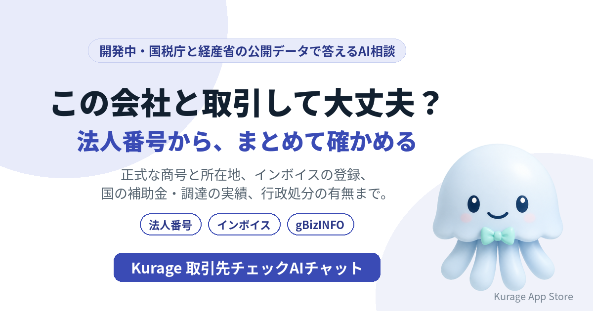

新しい取引先が出てきたとき、正式な商号と所在地、インボイスの登録、国との取引の実績を、いくつものサイトで調べていませんか。会社名か法人番号を入れると、国が公開している情報をまとめて集めて答えるAI相談システムを開発しています。名前は **Kurage 取引先チェックAIチャット** です。

- 詳しい説明: [Kurage 取引先チェックAIチャット（開発中）](https://exbridge.jp/solution/ktorihiki.html?ref=vibeblog_ktorihiki)
- Kurage App Store の掲載: [Kurage 取引先チェックAIチャット](https://kappstore.exbridge.jp/app.php?id=3925790d5cdbe66e&ref=vibeblog_ktorihiki)

まだシステムはありません。先に入口のページだけを公開し、使いたい方からの問い合わせやアクセスを見てから作ります。

## 「法人番号 検索」は月246,000回

キーワードプランナーで測ると（2026年10月1日）、取引先を調べる語はとても多く検索されています。

- 法人番号 検索: 246,000
- 法人番号 公表サイト: 27,100
- 反社チェック: 2,900
- gBizINFO: 2,400
- インボイス 登録番号 確認方法: 1,300

法人番号の公表サイトは国税庁が出しているので、番号を調べるだけなら困りません。困るのはその先です。インボイスの登録は別のサイト、国の補助金や調達の実績は経済産業省のgBizINFO、行政処分はまた別のサイト。取引先1社を確かめるのに、いくつも開くことになります。

## 会社名か法人番号から、まとめて

予定している答え方は次のとおりです。

- **正式な商号と所在地は？名前や住所は変わっている？** — 国税庁の法人番号の公表情報から、商号・所在地と変更の履歴を示します。同じ名前の会社が複数あれば、所在地で見分けられるように並べます。
- **インボイスの登録はある？** — 国税庁の適格請求書発行事業者の公表情報から、登録番号・登録日・取り消しの有無を示します。請求書の番号と照らし合わせる使い方を想定しています。
- **国の補助金や調達の実績は？** — gBizINFOから、補助金の交付・国との調達・表彰・届出認定の実績を示します。
- **行政処分は？** — 建設業などの行政処分の公表情報から、該当がないかを調べます。

## 分からないことは「分からない」と答える

いちばん大事にするのはここです。たとえば「反社チェック」は月2,900回検索されていますが、反社会的勢力かどうかは国の公開データには含まれていません。ここをAIにそれらしく答えさせるのが、いちばん危ない使い方です。

なので、集めた記録は出典つきで並べ、AIはそれを言い換えるだけにします。公開データで確かめられないことは「公開データでは確認できない」とはっきり答えます。取引してよいかの判断もしません。判断に使える事実を、短い時間でそろえるための道具です。

## 使う公開データ

- 国税庁の法人番号の公表情報（Web-APIは利用の申請が必要）
- 国税庁の適格請求書発行事業者の公表情報
- 経済産業省のgBizINFO（補助金・調達・表彰・届出認定・職場情報）
- 行政処分の公表情報（データの形と利用条件は取り込む前に確かめます）

## 作る前に、入口だけを出した理由

経理が請求書の受け取りで使うのか、営業や購買が新しい取引先の登録で使うのか、士業が顧問先のために使うのかで、画面も連携先も変わります。使いたい方の声を聞いてから、開発の順番と仕様を決めます。

## 使ってみたい方へ

社内の請求書の確認や取引先の登録の流れに組み込む形、AIエージェントから呼べるMCPサーバーの形を考えています。お気軽にお問い合わせください。

- [Kurage 取引先チェックAIチャット（開発中）の説明と問い合わせ](https://exbridge.jp/solution/ktorihiki.html?ref=vibeblog_ktorihiki)
