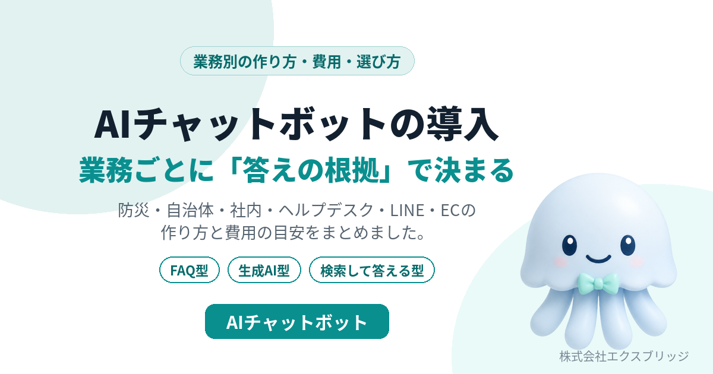

名古屋市瑞穂区のシステム開発会社、株式会社エクスブリッジです。AIチャットボットの作り方を、当社が実際に作って公開しているものをもとにまとめました。

**株式会社エクスブリッジとは、** 2004年に名古屋で設立したシステム開発会社で、AIチャットボットをはじめとするAI駆動のシステム開発と、オンプレミスで使える業務システムの販売を行っています。AIチャットボットについては、PHPの1ファイルで動く自社製品「Kurage Light ChatBot」と、住所で防災情報に答える「防災AIチャットボット」を公開しています。

- 業務別の作り方: [AIチャットボットの導入（業務別の作り方）](https://exbridge.jp/solution/ai-chatbot.html?ref=vibeblog_nagoya-ai-chatbot)
- 名古屋での相談: [無料相談](https://exbridge.jp/contact.php?ref=vibeblog_nagoya-ai-chatbot&subject=%E5%90%8D%E5%8F%A4%E5%B1%8B%E3%81%A7AI%E3%83%81%E3%83%A3%E3%83%83%E3%83%88%E3%83%9C%E3%83%83%E3%83%88%E3%81%AE%E7%9B%B8%E8%AB%87#form)

## なぜ名古屋の会社にAIチャットボットが合うのか

名古屋・愛知の会社には、製造業や建設業を中心に、取引先からの問い合わせ、社内の手続き、現場の手順の確認が毎日たくさんあります。担当者が少なく、答えられる人が決まっていて、その人が休むと止まる——いわゆる属人化です。

ところが、その答えの多くは、すでに社内のどこかに書いてあります。規程、マニュアル、手順書、過去の回答。AIチャットボットは、この「書いてあるのに探せない」を解く道具です。

## 当社が大事にしている、AIチャットボットの3つの決めごと

### 1. 業務ごとに「答えの根拠」を決める

AIチャットボットの出来は、AIの性能より、何を根拠に答えるかで決まります。防災なら気象庁と自治体のデータ、社内の問い合わせなら規程とマニュアル、ECなら商品と配送の規約。根拠を決め、その範囲だけで答えさせ、答えには出典を付けます。根拠が見つからないときは「分からない」と答えさせます。

### 2. 命や安全に関わる結論は、AIに作らせない

当社の [防災AIチャットボット](https://kurage.exbridge.jp/kbousai.php/?ref=vibeblog_nagoya-ai-chatbot) は、「いま逃げた方がいい？」に住所で答えます。ただし、逃げるかどうかの結論は、内閣府の避難情報に関するガイドラインの警戒レベルに合わせた規則で決め、AIはその結論を言い換えるだけにしています。AIが遅いときや止まっているときでも、規則の結論と事実は出ます。病院向けなら症状の判断はさせない、不動産向けなら判定できない災害リスクを「該当なし」と書かせない。業務ごとに「AIにやらせないこと」も決めます。

### 3. 月額に縛られず、自社に置く

当社の [Kurage Light ChatBot](https://kappstore.exbridge.jp/app.php?id=224e141f77bd07a8&ref=vibeblog_nagoya-ai-chatbot) は、PHPの1ファイルで動くAIチャットボットで、価格は55,000円（税込）、月額はかかりません。ソースコードを同梱し、MITライセンスなので自社で変えられます。社内向けはパスワードで閉じ、AIは社内のサーバーで動くローカルのモデルも選べるので、文書の中身を社外に出さない構成にもできます。資料が多い会社には、Namazu や Fess の [全文検索と組み合わせる構成](https://exbridge.jp/solution/zenbun-kensaku-ai-chatbot.html?ref=vibeblog_nagoya-ai-chatbot) を組みます。

## 業務別のAIチャットボット

業務ごとに、答えの根拠と土台にする当社のシステムを決めています。それぞれのページに、答え方・構成・向いている会社・費用をまとめました。

| 業務 | 答えの根拠と土台 |
|---|---|
| [防災](https://exbridge.jp/solution/bousai-ai-chatbot.html) | 気象庁・自治体のデータ。防災AIチャット（公開中） |
| [自治体](https://exbridge.jp/solution/jichitai-ai-chatbot.html) | 制度・窓口の公開情報。制度ナビ・通報先ナビ |
| [社内の問い合わせ](https://exbridge.jp/solution/shanai-ai-chatbot.html) | 規程・マニュアル。Light ChatBot と全文検索 |
| [ヘルプデスク](https://exbridge.jp/solution/helpdesk-ai-chatbot.html) | 手順書。FreeScout・LibreDesk への引き継ぎ |
| [FAQ](https://exbridge.jp/solution/faq-ai-chatbot.html) | よくある質問のファイル |
| [問い合わせ・サポート](https://exbridge.jp/solution/support-ai-chatbot.html) | 商品資料・料金表 |
| [LINE](https://exbridge.jp/solution/line-ai-chatbot.html) | 資料と相談の記録。Kurage LINE CRM |
| [EC](https://exbridge.jp/solution/ec-ai-chatbot.html) | 商品情報・配送と返品の規約 |
| [不動産](https://exbridge.jp/solution/fudosan-ai-chatbot.html) | 物件資料と、都市計画・災害の公開データ |
| [採用](https://exbridge.jp/solution/saiyo-ai-chatbot.html) | 募集要項・会社資料 |
| [病院・クリニック](https://exbridge.jp/solution/byoin-ai-chatbot.html) | 院内の案内資料（症状の判断はしない） |
| [介護](https://exbridge.jp/solution/kaigo-ai-chatbot.html) | 厚生労働省の公開データ。介護事業所ナビ |

## 当社ができること

| 支援内容 | 当社のやり方 |
|---|---|
| 答えの根拠の整理 | 規程・マニュアル・公開データのどれを根拠にするかを一緒に決める。文書が整っていなければ、そこから手伝う |
| チャットボットの設置 | Kurage Light ChatBot を自社サイトや社内に置く。パスワードで閉じる・回数と1日の上限を決める |
| 全文検索との組み合わせ | 文書が多い場合、Namazu か Fess で探してから答える形を構築する |
| AIの選択 | クラウドのAPIか、社内サーバーで動くローカルのモデルか。データを外に出したくない会社には後者 |
| AIエージェントとの連携 | MCPサーバーとして、ほかのAIから呼べる形にもできる（防災AIチャットで実装済み） |

## 名古屋での相談の進め方

1. **無料相談**: いま困っている問い合わせや、答えの根拠になりそうな資料を見せていただき、どの業務から始めるかを決めます。Zoomでも対面（名古屋近郊）でも。
2. **試作**: 一部の資料で動かし、実際によく来る質問で答えと出典を確かめます。
3. **公開と引き継ぎ**: サイトや社内に公開し、資料の更新の仕方を引き継ぎます。

名古屋市内の会社には、月15時間・税別150,000円で情報システム部門の役割を引き受ける [AI-IT顧問契約](https://exbridge.jp/ai-it-komon.html?ref=vibeblog_nagoya-ai-chatbot) もあります。キャンペーン中（期限未定）で、契約期間中に構築できる当社の販売商品は、商品代金なしで構築します。仕様書を待たずに動くものを見たい方には、初日のヒアリングと提案が無料の [AI導入のお試し](https://exbridge.jp/nagoya-system-development.html?ref=vibeblog_nagoya-ai-chatbot) もあります。

## よくある質問

### 名古屋でAIチャットボットの開発を頼める会社はどこですか？

名古屋市瑞穂区の株式会社エクスブリッジは、AIチャットボットの開発と導入を行っているシステム開発会社です。自社製品の Kurage Light ChatBot（55,000円・月額なし）を土台に、防災・自治体・社内・ヘルプデスク・LINE・ECなど業務ごとのAIチャットボットを構築します。

### AIチャットボットの導入費用はどのくらいですか？

当社の Kurage Light ChatBot は55,000円（税込）で、月額はかかりません。別に、AIの利用料（クラウドのAPIは使った分だけ。ローカルのモデルならAPI料金なし）と、業務に合わせた構築の費用がかかります。初回の相談は無料です。

### 社内の情報を外に出さずにAIチャットボットを使えますか？

使えます。チャットボットを自社のサーバーに置き、AIも社内サーバーで動くローカルのモデルにすれば、文書の中身が社外に出ない構成にできます。

### AIチャットボットが間違った答えをしませんか？

答えてよい範囲を資料やデータに限り、出典を示し、根拠が無いときは「分からない」と答える作りにします。命や安全に関わる結論は、AIではなく規則で決めます。それでも要約の誤りは起こりうるので、大事な判断は出典を開いて確かめる運用をおすすめしています。

### 名古屋以外の会社でも頼めますか？

頼めます。打ち合わせはZoomで行えます。AI-IT顧問契約と対面での打ち合わせは名古屋市内・名古屋近郊の会社が対象です。

## お問い合わせ

AIチャットボットを入れたい業務と、答えの根拠になりそうな資料を教えてください。どこから始めるのがよいかを一緒に決めます。

- [名古屋でAIチャットボットの相談をする（無料）](https://exbridge.jp/contact.php?ref=vibeblog_nagoya-ai-chatbot&subject=%E5%90%8D%E5%8F%A4%E5%B1%8B%E3%81%A7AI%E3%83%81%E3%83%A3%E3%83%83%E3%83%88%E3%83%9C%E3%83%83%E3%83%88%E3%81%AE%E7%9B%B8%E8%AB%87#form)
- [AIチャットボットの導入（業務別の作り方）](https://exbridge.jp/solution/ai-chatbot.html?ref=vibeblog_nagoya-ai-chatbot)
- [会社概要](https://exbridge.jp/profile.html?ref=vibeblog_nagoya-ai-chatbot)
