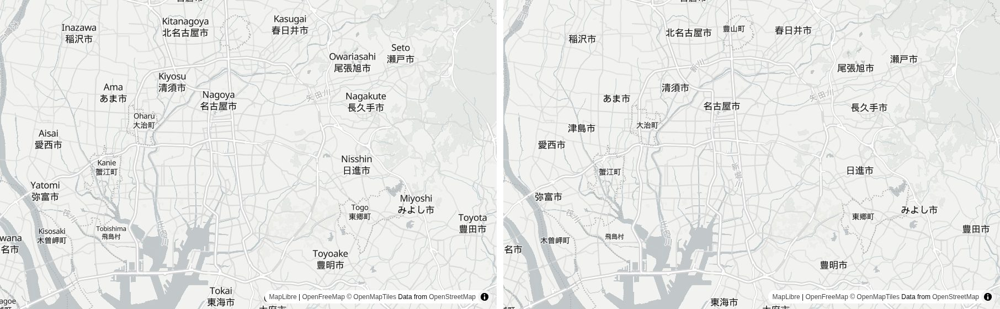
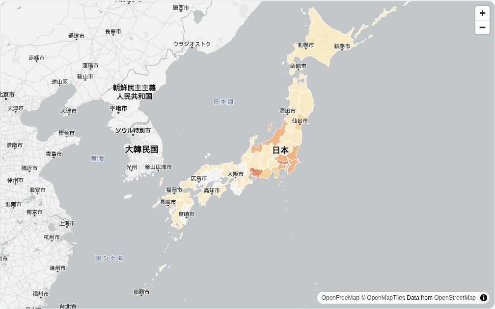

名古屋でAIシステム開発の会社をやっています。先日、インフルエンザや新型コロナの流行状況を、都道府県と名古屋市の区ごとに色分けして見せる「[Kurage 感染症マップ](https://kurage.exbridge.jp/kkansen.php/?ref=vibeblog_openfreemap)」を作りました。背景の地図には OpenFreeMap を使っています。

日本語で OpenFreeMap を使った例がまだ少ないので、やったことをそのまま書いておきます。

**OpenFreeMap とは、** OpenStreetMap のデータから作った地図（ベクタータイル）を無料で配っているサービスです。公式サイトには「表示回数やリクエスト数に上限はなく、登録も API キーも Cookie もいらない」と書かれています。運営費は寄付でまかなっていて、配信の仕組みはすべてオープンソースなので、自分のサーバーに同じものを立てることもできます。GitHub のスターは約6,100です（2026年10月時点）。

## OpenStreetMap 本家のタイルを使わない理由

地図を無料で出す方法として、まず思い浮かぶのは OpenStreetMap 本家のタイル（`tile.openstreetmap.org`）です。ただ、これは「データは誰でも自由に使えるが、タイルサーバーは違う」という立て付けです。[利用規約](https://operations.osmfoundation.org/policies/tiles/)には、次のようなことが書かれています。

- タイルサーバーは寄付とスポンサーで動いていて、容量に限りがある
- 重い使い方でサービスに影響が出れば、予告なく遮断することがある
- 稼働の保証（SLA）はない
- 商用サービスは、いつアクセスを止められてもおかしくないことを特に意識すること（有料の顧客に地図を出せなくなるおそれがある）
- 守れない場合は、OSM から作った別のサービスを使うか、自分で立てること

自治体や会社が、自社のサーバーで住民やお客さま向けに公開するサービスだと、これは合いません。規約自身が「別のサービスか、ベクタータイル」を勧めていて、その代表が OpenFreeMap です。

当社の製品も見直しました。地図を使っている製品の多くは国土地理院の地図を使っていましたが、[FixMyStreet の日本語導入キット](https://kappstore.exbridge.jp/app.php?id=b34e36cfaad27a14&ref=vibeblog_openfreemap)だけが、公式の既定のまま OpenStreetMap 本家のタイルを読んでいました。お客さまが自社のサーバーで公開するためのキットなので、国土地理院の淡色地図に切り替えました。FixMyStreet の地図は画像タイル前提の作りで、OpenFreeMap は画像タイルを配っていない（ベクタータイルだけ）ので、こちらは国土地理院にしています。

## 何も設定しないと、地名が「英語＋日本語」の2段になる

OpenFreeMap には、見た目の違う地図（スタイル）がいくつか用意されています。色を重ねる地図には、淡い灰色の `positron` が向いています。MapLibre GL JS で読むだけなら、これで動きます。

```html
<link rel="stylesheet" href="https://cdnjs.cloudflare.com/ajax/libs/maplibre-gl/4.7.1/maplibre-gl.css">
<script src="https://cdnjs.cloudflare.com/ajax/libs/maplibre-gl/4.7.1/maplibre-gl.js"></script>
<div id="map" style="height:480px"></div>
<script>
var map = new maplibregl.Map({
  container: 'map',
  style: 'https://tiles.openfreemap.org/styles/positron',
  center: [136.93, 35.15],
  zoom: 10.3
});
</script>
```

ただ、このままだと名古屋のあたりは「Nagoya／名古屋市」「Kasugai／春日井市」のように、ローマ字と日本語が2段で出ます。海外向けのスタイルなので、ラテン文字の名前を先に出す作りになっているためです。



## 地名を日本語にする（数行）

OpenStreetMap のデータには、地名ごとに `name:ja`（日本語名）が入っています。スタイルの読み込みが終わったら、文字を出している層（symbol 層）の参照先を、`name:ja` に差し替えます。日本語名が無い場所は、元の `name` に戻します。

```js
map.on('load', function () {
  map.getStyle().layers.forEach(function (l) {
    if (l.type === 'symbol' && l.layout && l.layout['text-field']) {
      map.setLayoutProperty(l.id, 'text-field',
        ['coalesce', ['get', 'name:ja'], ['get', 'name']]);
    }
  });
});
```

これで、上の画像の右側のように日本語だけになります。日本の外も日本語名が入っている場所は日本語になるので、全国の地図を出すと、朝鮮半島や中国の都市も「ソウル特別市」「上海市」のように出ます。

## 塗り分けは、地名の「下」に入れる

都道府県や区を色で塗るとき、何も考えずに `addLayer` すると、色が一番上に乗って地名が隠れます。最初の symbol 層の手前に差し込むと、色の上に地名が乗ります。

```js
var first = map.getStyle().layers.find(function (l) { return l.type === 'symbol'; });
map.addSource('a', { type: 'geojson', data: '/static/nagoya_wards.geojson' });
map.addLayer({
  id: 'fill', type: 'fill', source: 'a',
  paint: { 'fill-color': color, 'fill-opacity': 0.72 }
}, first && first.id);   // ← 2つ目の引数で「この層の手前」に入れる
```

名古屋市の16区を、インフルエンザの定点当たり報告数で塗ったのがこれです。区の上に「名古屋市」「清須市」などの地名がちゃんと見えています。


## つまずいたところ

**色の段階は、小さい順に並べないと何も塗られない。** 値で色を分ける `step` 式は、区切りの数字が昇順でないとエラーになり、塗りが丸ごと消えます。感染症ごとに区切りを変えていて、ある感染症だけ順番が崩れていました。画面にはエラーが出ないので、気づきにくいところです。

**全国を一度に見せるとき、沖縄がはみ出す。** 中心とズームで日本を出すと、画面の幅によって沖縄が切れます。`fitBounds` で、沖縄から北海道までが入る範囲を指定しました。

```js
map.fitBounds([[126.8, 25.6], [146.2, 45.6]], { padding: 10, duration: 0 });
```



**境界のデータが重い。** 都道府県の形は、国土交通省の国土数値情報（行政区域データ）を使いました。そのままだと都道府県だけで GeoJSON が約520MBあり、ブラウザに送れません。GDAL の `ogr2ogr` で、形を崩さない間引き（`ST_SimplifyPreserveTopology`）をかけて同じ都道府県の形をまとめ、座標の桁も落としました。47都道府県で約7,300点、ファイルは約160KBになりました。

```sh
ogr2ogr -f GeoJSON pref.geojson N03-20260101_prefecture.shp \
  -dialect sqlite \
  -sql "SELECT N03_001 AS name,
               ST_Union(ST_SimplifyPreserveTopology(geometry, 0.004)) AS geometry
        FROM 'N03-20260101_prefecture' GROUP BY N03_001" \
  -lco COORDINATE_PRECISION=4
```

間引きの強さ（`0.004` のところ）は、地図に出したときに県境のすき間が気にならない程度まで、何度か試して決めます。国土数値情報は CC BY 4.0 なので、「国土数値情報（行政区域データ）を加工して作成」と出典を載せています。

**出典の表示を消さない。** OpenFreeMap の地図には「OpenFreeMap © OpenMapTiles Data from OpenStreetMap」と、右下に出典が出ます。MapLibre が自動で出してくれるので、CSS で隠さないようにします。

## 自分のサーバーで公開する人向けに

感染症マップは、自治体や医師会、学校、地域のメディアが「自分の地域版」を持てるように、自社のサーバーに置く一式を [Kurage App Store](https://kappstore.exbridge.jp/app.php?id=f0f1422b462508b4&ref=vibeblog_openfreemap) で扱っています。地図は OpenFreeMap の公開版を読むので、地図のために API キーを取ったり、表示回数に応じた料金を払ったりする必要はありません。

もし「外のサービスが止まったら困る」という場合は、OpenFreeMap は配信の仕組みごとオープンソースなので、自社で同じものを立てることもできます（Ubuntu 24.04 のサーバーに入れる手順が公開されています）。ソースコードは [GitHub](https://github.com/katsushi2441/kkansen) で公開しています。

## よくある質問

### OpenFreeMap は商用でも無料で使えますか？

公式サイトでは、公開版は表示回数やリクエスト数に上限がなく、登録も API キーも不要とされています。公式サイトの FAQ では、商用利用は「可」です。ただし稼働の保証（SLA）や個別のサポートは今のところ無く、運営は寄付でまかなわれています。

### OpenFreeMap の地図を日本語表記にするには？

MapLibre でスタイルを読み込んだあと、文字を出している symbol 層の `text-field` を `['coalesce', ['get','name:ja'], ['get','name']]` に差し替えます。日本語名がある場所は日本語に、無い場所は元の名前になります。

### OpenStreetMap 本家のタイル（tile.openstreetmap.org）を使ってはいけないのですか？

少しの利用は認められていますが、利用規約では、タイルサーバーは寄付で動いていて容量に限りがあり、稼働の保証もなく、重い使い方は予告なく遮断されることがあると書かれています。商用サービスは特に注意するよう書かれていて、守れない場合は別のサービスを使うか自分で立てるよう勧めています。

### OpenFreeMap に画像タイル（PNG）はありますか？

ありません。OpenFreeMap はベクタータイルだけを配っていて、画像タイルは対象外だと README に書かれています。画像タイル前提の地図ライブラリ（古い OpenLayers など）で使う場合は、MapLibre に置き換えるか、日本の地図なら国土地理院のタイルを使う方法があります。

### Leaflet では使えますか？

Leaflet はもともと画像タイル向けのライブラリなので、ベクタータイルを出すには MapLibre を Leaflet の中で動かすプラグイン（maplibre-gl-leaflet）を使います。新しく作るなら、最初から MapLibre GL JS を使うほうが簡単です。
