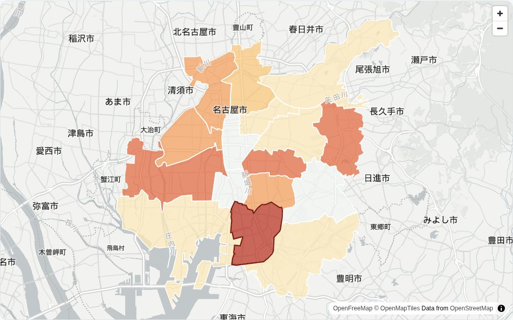

名古屋でAIシステム開発の会社をやっています。自社で作った「[Kurage 感染症マップ](https://kurage.exbridge.jp/kkansen.php/nagoya/?ref=vibeblog_nagoya-flu-1005)」が、名古屋市の週報と学級閉鎖の発表を毎日取り込んでいるので、その数字から名古屋市の今の様子をまとめておきます。

先に結論を書くと、**学級閉鎖は9月7日から10月1日までに104件**。**区ごとのインフルエンザは南区がいちばん多く、定点当たり36.00**で、国の警報の基準値（30）を超えています。

数字はどれも名古屋市の発表をそのまま使っています。警報・注意報は、国の基準値を区の値に当てはめた「目安」で、市が正式に出したものではありません。

## 区ごとのインフルエンザ（第39週・9月21日〜27日）

名古屋市の週報には、区ごとの患者の報告数と、区にある定点医療機関（報告をする医療機関）の数が載っています。患者数を定点の数で割ったのが「定点当たり」で、国はインフルエンザの場合、30以上を警報、10以上を注意報の基準にしています。

| 区 | 定点当たり（報告数） |
|---|---|
| 南区 | **36.00**（108人）警報レベルの目安 |
| 中川区 | 24.25（97人）注意報レベルの目安 |
| 昭和区 | 18.00（36人）注意報レベルの目安 |
| 名東区 | 15.33（46人）注意報レベルの目安 |
| 中村区 | 13.67（41人）注意報レベルの目安 |
| 瑞穂区 | 13.00（26人）注意報レベルの目安 |
| 西区 | 11.50（46人）注意報レベルの目安 |
| 北区 | 7.75（31人） |
| 千種区 | 6.25（25人） |
| 緑区 | 6.00（24人） |
| 東区 | 5.50（11人） |
| 守山区 | 4.25（17人） |
| 港区 | 3.00（9人） |
| 熱田区 | 2.00（4人） |
| 天白区 | 1.25（5人） |
| 中区 | 0.50（1人） |

市全体では527人で、定点当たり10.54でした。

### 前の週より減ったように見えるが、連休の週

市全体の報告数は、第38週（9月14日〜20日）の801人（定点当たり16.02）から、第39週は527人（10.54）に減っています。ただ、第39週は9月19日から23日までの5連休にかかっていて、休みの医療機関が多かった週です。報告数が減ったのは、患者が減ったからか、受診できる日が少なかったからか、この1週だけでは分かりません。次の週（第40週）の数字を見てから判断したほうがよさそうです。

区ごとに見ると、第38週は西区36.75・南区30.67・名東区29.67が多く、第39週は南区だけが30を超えました。

## 学級閉鎖（9月7日〜10月1日に判明した分）

名古屋市は「集団かぜ（インフルエンザ様疾患）による学級閉鎖等の状況」を、ほぼ毎日更新しています。今シーズン（9月〜）の分を数えると、次のとおりです。

- **合計 104件**（学級閉鎖86・休校12・学年閉鎖6）
- 学校の種類：小学校46件、高等学校39件、中学校16件、特別支援学校・専門学校・幼稚園が各1件
- 最初の発表は9月7日で、いちばん多かった日は9月17日（21件）
- 直近7日（9月28日〜10月1日に判明した分）は21件

区ごとの件数（今シーズン）は、次のとおりです。

| 区 | 件数 |
|---|---|
| 南区 | 11 |
| 瑞穂区 | 10 |
| 昭和区・東区・西区・千種区 | 各9 |
| 熱田区・名東区 | 各8 |
| 緑区 | 7 |
| 守山区・北区 | 各5 |
| 中川区・港区 | 各4 |
| 天白区 | 3 |
| 中区 | 2 |
| 中村区 | 1 |

瑞穂区は、区の患者数（定点当たり13.00）のわりに件数が多めです。10件のうち8件が高等学校で、区の外から通う生徒の多い学校の分が入っています。学級閉鎖の件数は、その区に住む人の流行の度合いとは別のものとして見たほうがよさそうです。学校名・学年組・期間の一覧は、[学級閉鎖のページ](https://kurage.exbridge.jp/kkansen.php/gakkyu/?ref=vibeblog_nagoya-flu-1005)で見られます。

## 愛知県と全国

国の速報（第38週・9月14日〜20日）では、愛知県の定点当たりは15.12で、前の週の6.58から2倍を超えました。全国は8.48で、注意報の目安を超えた都道府県は9つです。名古屋市の週報は国の速報より1週早く出るので、名古屋の数字のほうが新しいことがあります。

## 自分の区を見るには

[Kurage 感染症マップ](https://kurage.exbridge.jp/kkansen.php/?ref=vibeblog_nagoya-flu-1005)で、住所を入れるか「現在地で」を押すと、区のページに進めます。区のページには、今年の推移と、区内の学級閉鎖の一覧が出ます。数字は毎日、新しい発表が出ていないかを確かめて取り込んでいます。

Claude などの AI から使う場合は、MCP（AI から数字を引くための入口）も用意しています。「名古屋市南区の今週のインフルエンザと学級閉鎖は？」と聞くと、週と出典のリンクつきで答えが返ります。使い方は[データについて](https://kurage.exbridge.jp/kkansen.php/about#mcp)に書いています。

## よくある質問

### 名古屋市の学級閉鎖の情報はどこで発表されていますか？

名古屋市のサイトの「集団かぜ（インフルエンザ様疾患）による学級閉鎖等の状況」で、PDF がほぼ毎日更新されています。この記事の数字は、10月2日付の PDF（10月1日に判明した分まで）から数えました。

### 区ごとのインフルエンザの数字はどこで分かりますか？

名古屋市の「感染症発生動向調査」の週報に、区ごとの患者の報告数と定点の数が載っています。週報は PDF で、毎週出ます。Kurage 感染症マップでは、そこから定点当たりを計算して区ごとに並べています。

### 南区は警報が出ているのですか？

市が正式に警報を出したわけではありません。国の基準値（定点当たり30以上で警報）を南区の値に当てはめると超えている、という「目安」です。正式な警報・注意報は、自治体が保健所の管内ごとに判断して出します。

### 体調が悪いときはどうすればいいですか？

この記事と Kurage 感染症マップは、公式の数字を見やすく並べるだけで、受診すべきかどうかの判断はしません。かかりつけの医療機関や、名古屋市・保健センターの案内に従ってください。
