名古屋でAIシステム開発の会社をやっています。デジタル民主主義の道具は、名前がたくさん出てくる割に、どれが何をするものなのかが分かりにくいと感じていました。そこで、議員事務所や自治体の方に説明するために、海外と日本の道具を「政策づくりのどの工程を受け持つか」で並べた資料を作りました。12枚のスライドを、そのまま載せます。

## 1. 声を聞くところから、合意をつくるところまで

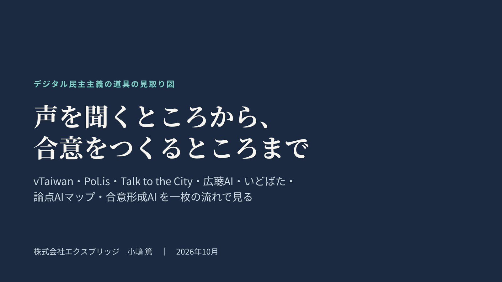

取り上げるのは、台湾の vTaiwan、Pol.is、Talk to the City、デジタル民主主義2030（DD2030）の広聴AIといどばた、当社の論点AIマップと合意形成AIの7つです。どれが優れているかではなく、どこをつなげば政策づくりに使えるかを見るための資料です。

## 2. それぞれが受け持つ工程

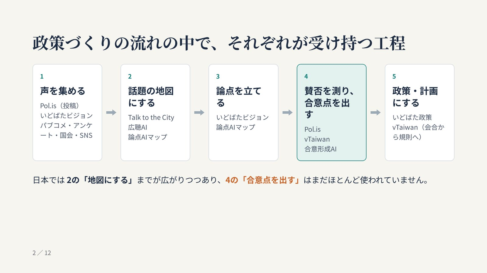

政策づくりを「声を集める」「話題の地図にする」「論点を立てる」「賛否を測り、合意点を出す」「政策・計画にする」の5つに分けると、道具どうしは競合ではなく、受け持つ工程が違うことが分かります。日本では「集めて地図にする」までが広がりつつあり、「どこで割れていて、どこなら合意できるか」を出す4つ目の工程はまだほとんど使われていません。

## 3. 台湾 vTaiwan とオードリー・タン氏

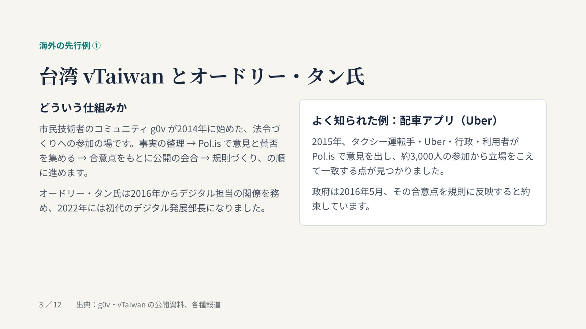

vTaiwan は、市民技術者のコミュニティ g0v が2014年に始めた、法令づくりへの参加の場です。よく知られているのは2015年の配車アプリ（Uber）の例で、タクシー運転手、Uber、行政、利用者が Pol.is で意見を出し、立場をこえて一致する点をもとに規則が決まりました。要はAIよりも手順で、合意点が公開の会合の議題を決める役割を果たしています。

## 4. Pol.is：多数決ではなく「立場をこえた一致」を探す

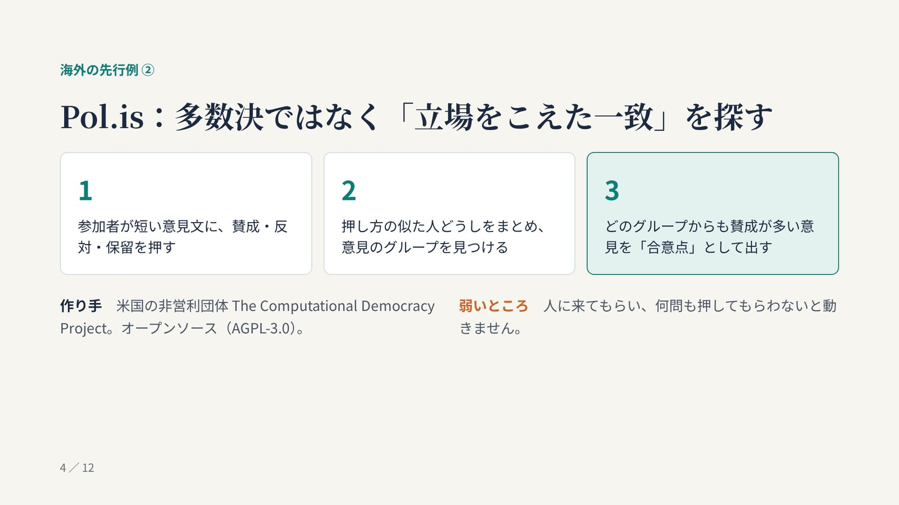

Pol.is は、参加者が短い意見文に賛成か反対かを押し、押し方の似た人どうしをまとめて意見のグループを見つけ、どのグループからも賛成が多い意見を合意点として出します。人数の多いグループを勝たせるのではなく、立場の違う人たちがそろって賛成できる点を探すところが多数決との違いです。一方で、人に来てもらい何問も押してもらわないと動かない、という弱さがあります。

## 5. Talk to the City：大量の自由記述を、AIで話題の地図に

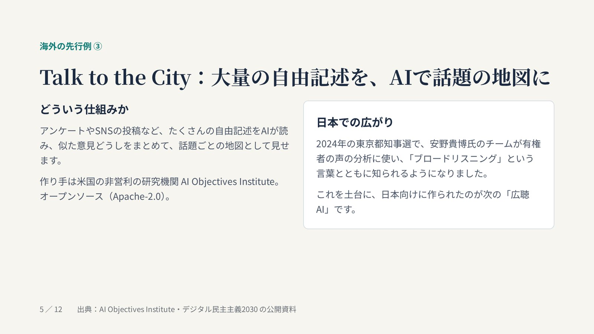

Talk to the City は、米国の研究機関 AI Objectives Institute が作った、たくさんの自由記述をAIが読んで話題ごとの地図にする道具です。2024年の東京都知事選で安野貴博氏のチームが有権者の声の分析に使い、「ブロードリスニング」という言葉とともに日本でも知られるようになりました。出すのは話題の地図で、賛否の割れ方や合意点を計算する仕組みではありません。

## 6. デジタル民主主義2030：広聴AI と いどばた

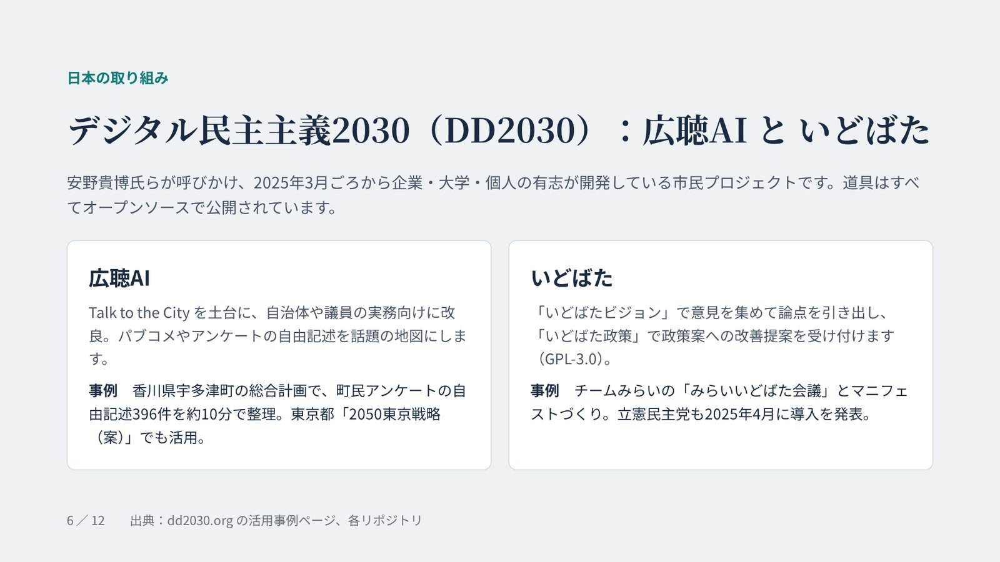

DD2030 は、企業・大学・個人の有志がオープンソースで道具を開発している市民プロジェクトです。広聴AIは Talk to the City を土台に自治体や議員の実務向けに改良したもので、香川県宇多津町では町民アンケートの自由記述396件を約10分で整理しています。いどばたは、意見を集めて論点を引き出す「いどばたビジョン」と、政策案への改善提案を受け付ける「いどばた政策」からなります。当社も DD2030 に参加していて、広聴AIをローカルの生成AIで動かしやすくする修正を提案し、取り込まれています。

## 7. 論点AIマップ：すでにある声から、話題の地図と論点を

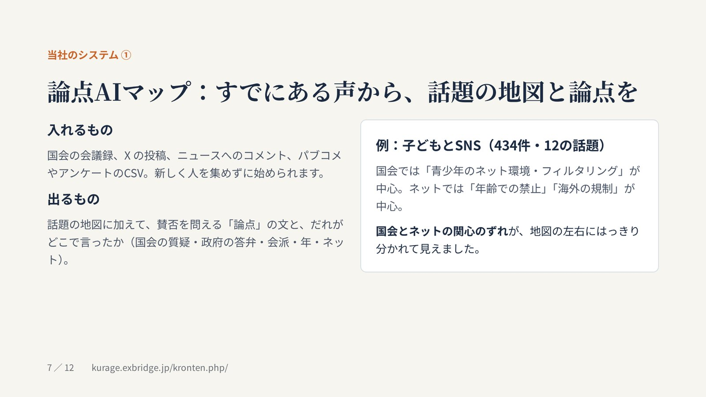

当社の[論点AIマップ](https://kurage.exbridge.jp/kronten.php/?ref=vibeblog_ddtools)は、国会の会議録、X の投稿、ニュースへのコメント、パブコメやアンケートのCSVを入れて、話題の地図に加えて賛否を問える論点の文と、だれがどこで言ったかの内訳を出します。子どもとSNSの例では、国会は「青少年のネット環境・フィルタリング」、ネットは「年齢での禁止」「海外の規制」が中心で、国会とネットの関心のずれがはっきり見えました。

## 8. 合意形成AI：人の票がなくても割れ方が出る

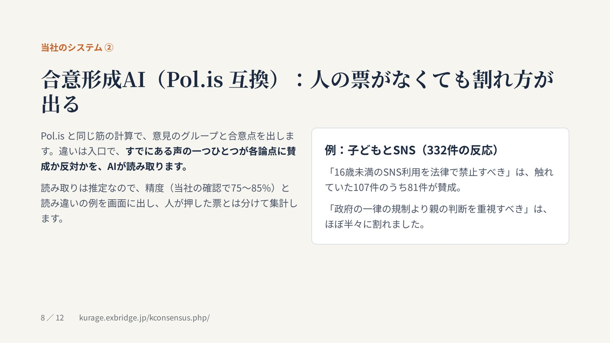

[合意形成AI（Pol.is 互換）](https://kurage.exbridge.jp/kconsensus.php/?ref=vibeblog_ddtools)は、Pol.is と同じ筋の計算で意見のグループと合意点を出します。違いは入口で、すでにある声の一つひとつが各論点に賛成か反対かをAIが読み取ります。読み取りは推定なので、精度（当社の確認で75〜85%）と読み違いの例を画面に出し、人が押した票とは分けて集計しています。子どもとSNSでは、「16歳未満のSNS利用を法律で禁止すべき」は触れていた107件のうち81件が賛成、「政府の一律の規制より親の判断を重視すべき」はほぼ半々に割れました。

## 9. 並べて比べる

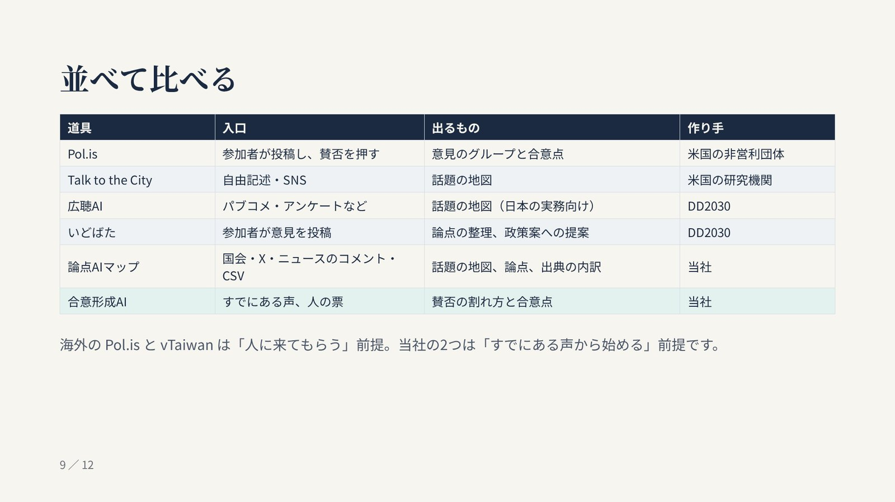

表の上から下へ、だいたい政策づくりの流れの順に並べています。日本で使われるかどうかを分けるのは、入口が「人に投稿してもらう」か「すでにある声を使う」かだと考えています。

## 10. 日本の現状

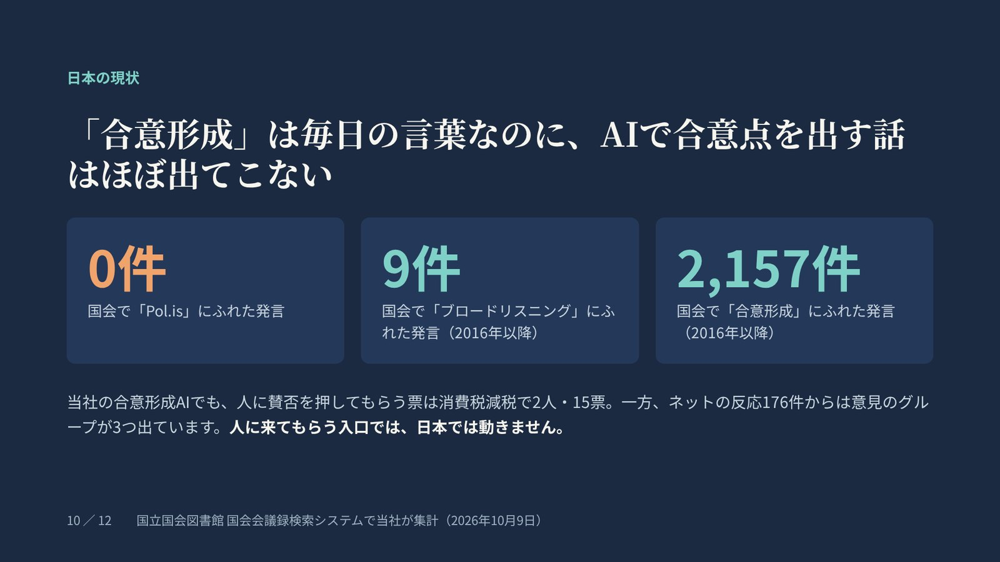

国会の会議録を数えると、「合意形成」にふれた発言は2016年以降で2,157件あるのに、「Pol.is」は0件、「ブロードリスニング」は9件でした。当社の合意形成AIでも、人に賛否を押してもらう票は消費税減税で2人・15票にとどまる一方、ネットの反応176件からは意見のグループが3つ出ています。人に来てもらう入口だけでは、日本では動きにくいということです。詳しくは[パブリックコメントやアンケートの自由記述から、AIで意見の割れ方と合意点を出す](https://exbridge.jp/vibeblog/2026-10-09-pubcom-free-text-consensus-ai.html)に書きました。

## 11. すでにある声から始めて、つなぐ

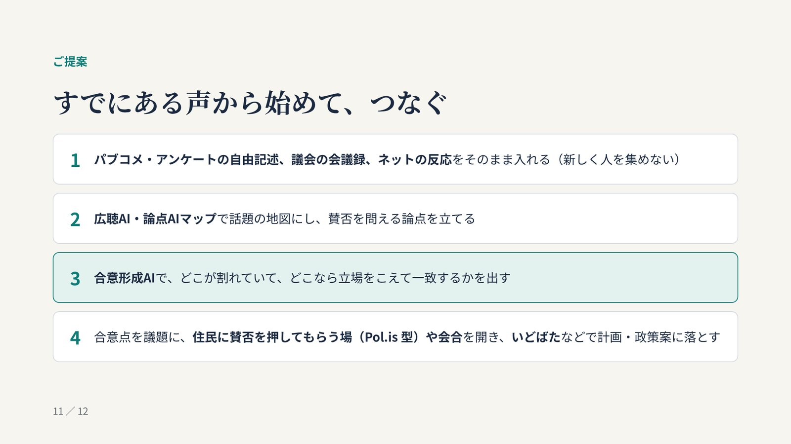

パブコメやアンケートの自由記述、議会の会議録、ネットの反応をそのまま入れ、広聴AIや論点AIマップで地図にして論点を立て、合意形成AIで割れ方と合意点を出します。そのうえで、合意点を議題に住民に賛否を押してもらう場や会合を開き、いどばたなどで計画や政策案に落とす。vTaiwan が合意点で会合の議題を決めたように、合意点は「何を話し合うか」を決める材料として使うのが本筋だと考えています。

## 12. 実際の画面

- [論点AIマップ](https://kurage.exbridge.jp/kronten.php/?ref=vibeblog_ddtools)
- [合意形成AI（合意点マップ）](https://kurage.exbridge.jp/kconsensus.php/?ref=vibeblog_ddtools)
- [国会トラッカー](https://xb4g.com/giin/tracker/?ref=vibeblog_ddtools)

## よくある質問

### ブロードリスニングと合意形成は何が違いますか？

いま日本で使われているブロードリスニングは、たくさんの声を集めて、似た意見どうしをまとめて地図のように見せるところまでを指すことがほとんどです。合意形成は、その先で「どこで意見が割れていて、どこなら立場をこえて一致できるか」を出し、話し合いや決定につなげる工程です。

### Pol.is と Talk to the City は何が違いますか？

Pol.is は参加者に賛否を押してもらい、意見のグループと合意点を計算します。Talk to the City は自由記述をAIで読み、話題ごとの地図にします。前者は賛否の割れ方、後者は話題の広がりを見る道具です。

### 広聴AIやいどばたと、論点AIマップ・合意形成AIは競合しますか？

競合ではなく、受け持つ工程が違います。広聴AIは自由記述を地図にする工程、いどばたは意見の収集と政策案への提案の工程を受け持ちます。論点AIマップは地図に論点と出典の内訳を足し、合意形成AIは賛否の割れ方と合意点を出す工程を受け持ちます。組み合わせて使えます。

### 住民の意見を外部に出さずに使えますか？

論点AIマップと合意形成AIは、自治体や議員事務所のサーバーに置ける形で作っていて、読み取りには手元の生成AIを使います。意見の文章を外部のAIのサービスに送ることはありません。
